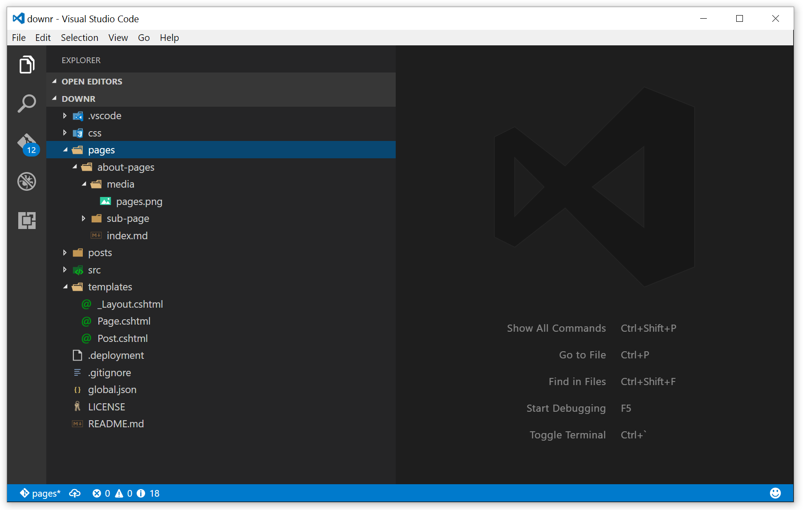

downr pages are markdown files that are stored hierarchically in the `pages` directory at the root of the downr repository. To create pages, just make a new folder in the `pages` folder and create an `index.md` file, then add the downr metadata to the top of the file as shown in the code block below. 

    ---
    title: Pages
    author: BenjaminAbt
    lastModified: 2017-01-09 12:00:00
    pubDate: 2017-01-09 12:00:00
    categories: downr
    ---

The screen shot below shows the default structure of a downr site, with this page and a sub-page. 

Pages can be used to segment your downr site into logical sections. Each section can have sub-sections [like this one](/about-pages/sub-page). 