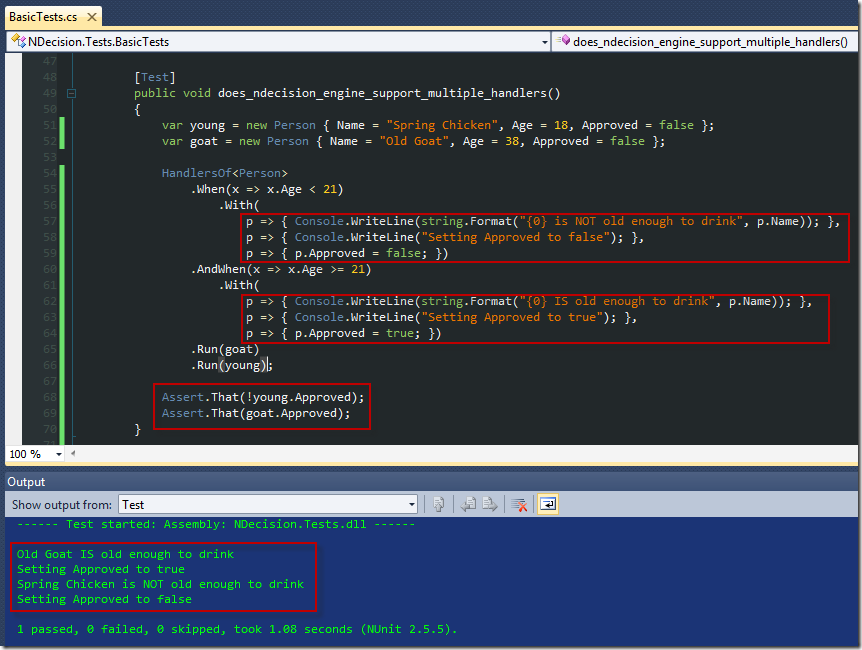

After the first post on NDecision I realized there&#x2019;s room for improvement &#x2013; allow for multiple directions when a test expression passes. This way one .Run() call on a target results in the ability to chain multiple processes together. Kind of like a Saga
  in ESB, but maybe not quite. Anyway, here&#x2019;s the test that demonstrates the ability.

  

