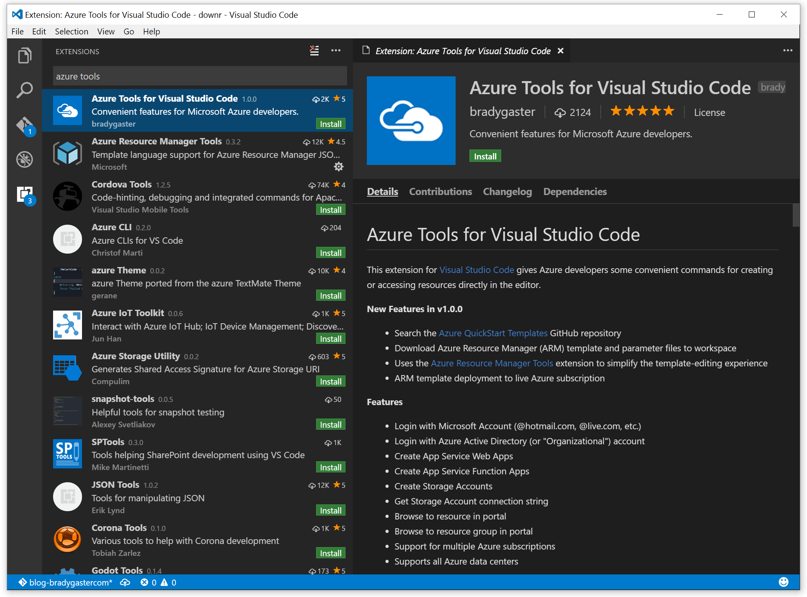
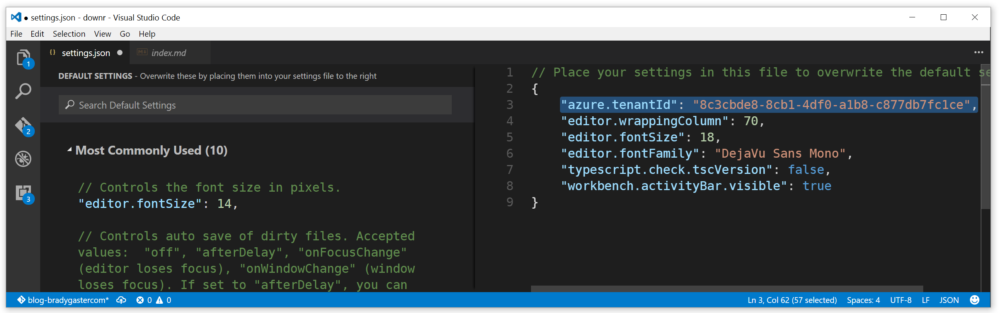

Today I'm excited to officially announce the 1.0.0 release of the [Azure Tools for Visual Studio Code extension](http://aka.ms/vscodeazuretools). This post will summarize the features available in the extension, provide you with links to demonstration videos so you can learn more, and let you know how you can install the extension and get going with it. In seconds you'll be managing your Azure resources and deploying new topologies **on a Mac, PC, or Linux development workstation**. 

## Bring Azure Development to Every Platform
The Azure Tools for Visual Studio Code (ATVSC) began as a simple enough idea: Visual Studio Code supports extensions built using, among other languages, Node.js. We have a great [Node.js SDK for Azure](http://azure.github.io/azure-sdk-for-node/index.html), so it felt like a natural combination that would deliver Azure developer features to any desktop that supports Visual Studio Code. Even though developers already have great Azure management features via the Azure CLI and XPlat CLI tools for managing resources, Visual Studio offers an integrated experience tailored for **the developer**. With so many developers using non-Windows workstations to develop for Azure, why should Visual Studio developers be the only ones who have an integrated Azure development and management experience in their code editors? 

So I started working on the product and within a few hours was installing a very early prototype on my wife's Apple laptop as she stood behind me with a concerned look on her face wondering why I was typing in a command line and enjoying it. 

### Minimum Viable Product and Reality
After a few days I'd made some decisions about the extension in order to come up with a tangible list of feature ideas I'd tackle for my initial release:

* Be built using the Node.js SDK for Azure
* Target Web, Mobile, API, and Azure Function developers
* Provide Azure Resource Manager (ARM) template search and deployment features
* Not persist authentication tokens between Visual Studio Code user sessions
* Be exposed primarily via the Visual Studio Code command palette

Realistically, I didn't have a lot of time to dedicate to the development so I recruited help, too. My good friends and colleagues [Ian Philpot](https://twitter.com/tripdubroot) from Atlanta and [Anze Vodovnik](https://twitter.com/Avodovnik) from Slovenia (who's now in the UK), offered some ideas and coding assistance on a few features in the extension. We also ran some of our ideas by [Stuart Leeks](https://twitter.com/stuartleeks), who naturally had some great feedback. During the 1.1.0 release, [Christos](https://twitter.com/ChristosMatskas) [Matskas](https://cmatskas.com/) got involved and contributed a great list of features like Key Vault and Batch account creation functionality. 

> All of the folks working on the extension did so in their spare time. We worked for a few hours here and there in the evenings and put this together skunkworks-style. The ATVSC is free-form, open-source, and unsupported aside from the growing community of folks interested in it. 

It was great to see an organic interest in my colleagues and from the Visual Studio Code team, namely [Chris Dias](https://twitter.com/chrisdias?lang=en) and [Wade Anderson](https://twitter.com/waderyan_) who supported us and gave some ideas. What's interesting is that the time I'd thought I'd need to get things done was far loftier than reality - the Visual Studio Code extension framework and Azure Node SDK are both pretty easy to use, if not elegant in places. 

### Features
We came up with a great list of features for the 1.0.0 release, which are also listed on the [Azure Tools for Visual Studio Code](https://marketplace.visualstudio.com/items?itemName=bradygaster.azuretoolsforvscode) marketplace page. 

* **Browser-based login** - No logging into the editor directly. Instead, we use device authentication and a browser-based authentication flow to keep the tool less complex. There's no authentication code to manually copy, either - the extension copies the authentication code to your clipboard and directs you to the device login page, where it can be easily pasted, streamlining login. 
* **Multiple Azure Subscription support** - login once, select any of your subscriptions to manage.
* **Multiple region support** - Use the toolbar button or command palette to specify your active data center.
* **Web App Creation** - the extension offers a "basic" and "advanced" mode. Basic captures the name of your Web App and then creates a resource group, hosting plan, and app named the same. Advanced mode allows you to specify new or existing resource group, customize the hosting plan and resource group name. [Here is a demonstration video on a Mac](https://www.youtube.com/watch?v=-TtJujbKE00) of developing a .NET Core web app that's deployed to an Azure Web App created using the Azure Tools Visual Studio Code extension. 
    
    <iframe width="560" height="315" src="https://www.youtube.com/embed/-TtJujbKE00" frameborder="0" allowfullscreen></iframe>

* **Function App Creation** - the extension offers a "basic" and "advanced" mode. Basic captures the name of your Function App and then creates a resource group, hosting plan, and app named the same. Advanced mode allows you to specify new or existing resource group, customize the hosting plan and resource group name. [Watch a video here](https://www.youtube.com/watch?v=7UQtUmsRHtY&t=2s) on deploying an Azure Function built using [Yeoman](http://yeoman.io) templates to a live Azure subscription. 
    <iframe width="560" height="315" src="https://www.youtube.com/embed/7UQtUmsRHtY" frameborder="0" allowfullscreen></iframe>

* **Storage Account Features** - Create storage accounts directly within Visual Studio Code and retrieve their connection strings for pasting them into configuration files or Azure Key Vault. You can [watch a video here on Storage functionality](https://www.youtube.com/watch?v=98BHeUQ38Bo) provided in the extension. 
    
    <iframe width="560" height="315" src="https://www.youtube.com/embed/98BHeUQ38Bo" frameborder="0" allowfullscreen></iframe>

* **Azure Resource Manager (ARM) template support** - From within Visual Studio Code, search for and download Azure Resource Manager (ARM) templates directly from the QuickStarts repository. The ATVSC takes ships bundled with the [Azure Resource Manager Tools](https://marketplace.visualstudio.com/items?itemName=msazurermtools.azurerm-vscode-tools), so once you download the templates they're easily editable directly within Visual Studio Code.
* **Azure Resource Manager (ARM) template Deployment** - Once you've edited your template and parameters files, these can be deployed directly to Azure using the ARM template deployment features of the Azure SDK. [Here is a video](https://www.youtube.com/watch?v=MR3waSruC2A) (also shown below) demonstrating an end-to-end experience of searching for, downloading, editing, and finally deploying a topology directly to Azure. 

    <iframe width="560" height="315" src="https://www.youtube.com/embed/MR3waSruC2A" frameborder="0" allowfullscreen></iframe>

## Installation
Thanks to Visual Studio Code's built-in extension tab, finding the extension is as easy as searching for "Azure Tools" and then installing the extension. 

Once the extension installs you'll need to restart Code. Then you can login and get started. The login command supports Microsoft Account and Organizational Account login, so you have a pair of authentication options. 

> Note: If you want to login with a @outlook.com, @live.com, or @hotmail.com account - a.k.a. a "Microsoft Account," you'll need to set the **azure.tenantId** setting using the **File -> Preference -> User or Workspace settings** gesture within Visual Studio Code. The screen shot below demonstrates this. 

## What's Next?
At this point we're sure the Azure Tools for Visual Studio code offers a great tool for developer who are already using the Azure portal for managing their resources and the command line tools for provisioning or configuring things during the development or devops lifecycle. Our goal was to enable developers for whom Visual Studio isn't an option with Azure development tools and with provisioning and template capabilities, and this first release delivers that goal. 

The extension is available as an open-source project and can be found in the GitHub repository [https://github.com/bradygaster/azure-tools-vscode](https://github.com/bradygaster/azure-tools-vscode). If you experience any issues or have suggestions or feature requests, use the GitHub repository's [Issues](https://github.com/bradygaster/azure-tools-vscode/issues) page. Of course, contributions are welcome too, and all pull requests will be reviewed carefully. 

## Enjoy it!
Take a moment and give the extension a spin. We're interested in what you think, how to take it to the next level, and what sort of features you'd like to see next. Happy coding!