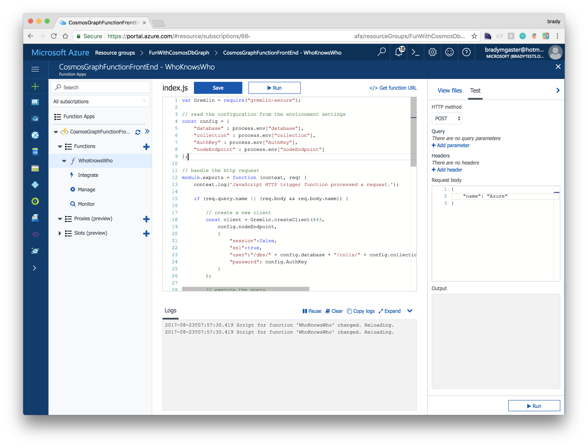

A few days ago [I blogged about using Functions, .NET, and Cosmos DB's Graph API](/azure-cosmosdb-with-functions) together, and as I pointed out in an update to that post accompanying this one, the experience of working with Cosmos DB's Graph API was exciting and had offered some interesting opportunities and mental exercises. The first [somewhat constructive] criticism I received on the initial post was from my friend and colleague [Burke Holland](https://medium.com/burke-knows-words), who asked **"where's the Node.js love?**," to which I replied "**I wanted to use the VS Functions tools and I'm more comfortable with .NET and...**" and Burke cut me off in mid-message with clear judgment and purpose:

<table style="margin-bottom: 10px;">
    <tr>
        <td></td>
        <td><blockquote>"Nobody puts Node in the corner."</blockquote></td>
    </tr>
</table>

I can't ignore a strong argument that conjures that gem of filmography and choreography, so the second post in the series will give Node.js a break from the battlefield, escorting it right back onto the dancefloor. I'll show you how to build a quick-and-dirty serverless Azure Function that uses the open-source [gremlin-secure NPM package](https://www.npmjs.com/package/gremlin-secure) to query the same Cosmos DB Graph database from the original post and [docs.microsoft.com](http://docs.microsoft.com) article [Azure Cosmos DB's Graph API .NET Client](https://docs.microsoft.com/en-us/azure/cosmos-db/create-graph-dotnet). The Node.js post will give us an HTTP API we can call when we want to get a list of all the people who know one specific person. 

## Part 2 of the Serverless & Schemaless Series

Functions and Cosmos DB's nature together create a **Serverless & Schemaless Scenario**, and the opportunities this scenario provides for agile developers dealing with evolving structures and processes seem vast. This post is one in what I call the **Serverless & Schemaless Series**:

1. [Querying Azure Cosmos DB's Graph API using an Azure Function](/azure-cosmosdb-with-functions) - Walks through creating a .NET Function that queries Cosmos DB's Graph API using the Cosmos DB Graph API .NET SDK. 
1. [Querying Azure Cosmos DB using serverless Node.js](/azure-cosmosdb-with-functions-and-nodejs) (this post) 
1. TBD
1. TBD

## Creating an Azure Function with Node.js

The [Azure Functions JavaScript developer guide](https://docs.microsoft.com/en-us/azure/azure-functions/functions-reference-node) has a wealth of information on some of the internal Function SDKs, as well as how to do things like reading environment variables into your code that you configure in the Azure portal, and more. This is definitely recommended reading for more context on some of the lower-level details we won't cover in this post. 

Let's dive in and create a new Azure Function, using JavaScript as the language du jour and the `HttpTrigger` template as a getting-started point. 


Once the new Function has been created and deployed into your Azure subscription and resource group, the Functions editing experience will open in the portal. Note a few key areas of the window: 

1. The code editor, where we can make updates to our serverless code. 
1. The **Test** area on the right side of the code editor. This dialog is useful for executing test commands against an Azure Function. The `HttpTrigger` template has a `name` parameter expected, so the **Request body** widget provides a quick way of editing the request content. 
1. The **View Files** tab. It provides quick access to the `*.js`, `*.json`, and other source code files that comprise a Function. 


The code below is also available in [my fork](https://github.com/bradygaster/azure-cosmos-db-graph-dotnet-getting-started) of the original code used in the [article](https://docs.microsoft.com/en-us/azure/cosmos-db/create-graph-dotnet) that got me started. Copy this code and paste it into the code editor in the Azure portal. Portions of the source code below was borrowed (okay, it was *stolen and bastardized*) from the Cosmos DB team's great code sample on [Getting Started with Node.js and the Graph API](https://github.com/Azure-Samples/azure-cosmos-db-graph-nodejs-getting-started). 

```javascript
var Gremlin = require("gremlin-secure");

// read the configuration from the environment settings
const config = {
    "database" : process.env["database"],
    "collection" : process.env["collection"],
    "AuthKey" : process.env["AuthKey"],
    "nodeEndpoint" : process.env["nodeEndpoint"]
};

// handle the http request
module.exports = function (context, req) {
    context.log('JavaScript HTTP trigger function processed a request.');

    if (req.query.name || (req.body && req.body.name)) {

        // create a new client
        const client = Gremlin.createClient(443, 
            config.nodeEndpoint,
            {
                "session":false,
                "ssl":true,
                "user":"/dbs/" + config.database + "/colls/" + config.collection,
                "password": config.AuthKey
            }
        );

        // execute the query
        client.execute("g.V().outE('knows').where(inV().has('id','" + (req.query.name || req.body.name) + "'))", { }, (err, results) => {
            if (err) return console.error(err);
            console.log(results);

            // return the results
            context.res = {
                // status: 200, /* Defaults to 200 */
                body: results
            };

            context.done();
        });
    }
    else {
        context.res = {
            status: 400,
            body: "Please pass a name on the query string or in the request body"
        };

        context.done();
    }
};
```

Once you paste in the code the editor should look more like this. 



Note in particular these lines from the source code for the Node.js Function. These lines of code read from the environment variables for the Function, which can be set using the Azure portal. 

```javascript
// read the configuration from the environment settings
const config = {
    "database" : process.env["database"],
    "collection" : process.env["collection"],
    "AuthKey" : process.env["AuthKey"],
    "nodeEndpoint" : process.env["nodeEndpoint"]
};
```

You can avoid putting the environment variables into your source code and your source control repository. To set up these variables you can go to the Application Settings blade of your Function (or any other App Service). You can get to the Application Settings blade from the **Platform features** blade in your Function app. 


Each of the Application Settings are available to the Node.js code as environment variables, accessible using the `process.env[name]` coding pattern. Note the **AuthKey** setting - it is the same key that's being used by the .NET code from the [first post](/azure-cosmosdb-with-functions) in this series. Since the .NET Function and the Node.js Function would be running in the same App Service instance, both can share these Application settings. 

That said, the Gremlin NPM package for Node.js expects a slightly different URL structure than the .NET client, so the `nodeEndpoint` Application Setting will function to provide the Node.js Function the URL it'll reach out to when communicating with the Graph API. 


## Installing Dependencies via NPM

Since the Node.js code for the Azure Function will make use of the [gremlin-secure NPM package](https://www.npmjs.com/package/gremlin-secure) to issue queries over to the Cosmos DB Graph, I'll need to install that and any other dependent NPM packages into my Function before it'll run properly. 

If I was using a Git deploy model here, the [Kudu](https://github.com/projectkudu/kudu) deployment engine is smart enough to know how to install NPM packages for me. But I'm not using Kudu explicitly in this particular App Service, I'm building it using the web-based Azure Portal code editor and testing tools.

Luckilly, Kudu and App Service make it just as easy to install NPM packages using the portal as it is using Git deploy. As with any proper Node.js app, I'll need to add a `package.json` file to my app so that I can inform NPM which dependent packages the code will need. To create a new file in my Function's file store named `package.json`.


Next, add the following code to the `package.json` file you just added to the Function. The code is also in the [repository](https://github.com/bradygaster/azure-cosmos-db-graph-dotnet-getting-started) containing this blog's sample code. 

```json
{
  "name": "node-gremlin",
  "version": "0.0.0",
  "description": "",
  "homepage": "",
  "author": {
    "name": "username",
    "email": "email@address.com",
    "url": "yoursite.com"
  },
  "main": "lib/index.js",
  "keywords": [
    "cosmos db",
    "gremlin",
    "node",
    "azure"
  ],
  "license": "MIT",
  "dependencies": {
    "gremlin-secure": "^1.0.2"
  }
}

```

The screen shot below shows what the `package.json` looks like once I added it to my own function. Note, I've customized my `author` metadata and added `keywords` to the file's content; you may want to customize these to reflect your own... um... *meta?*


On the **Platform Features** blade there's an icon in the **Development Tools** area called **Console**. Clicking this icon will bring up an interactive console window, right in the browser. By executing NPM commands using this console it is possible to install all the dependencies your app needs manually. 


The screen shot below shows how I first need to `cd` into the correct folder to find the `package.json` I just created. Once I find that folder and move into it, executing an `npm install` will bring down all the NPM dependencies needed by the Node.js code. 


When I flip back to the **View files** blade in the portal, I can see that the `node_modules` folder has been created. The dependencies have been installed, so now I can safely execute to Function and test it out using the portal's development tools. 


Now that all the dependencies have been installed I can test the function directly in the Azure portal. 

## Testing the Function

The Test segment of the Azure portal is great for making sure Functions operate as expected. The test tool helps debugging and validating that things are working properly. 

Using the **Request body** area of the portal, I can customize the JSON content that will be POSTed over HTTP to the Function endpoint. 


Note the JSON below in the bottom-right corner of the Azure portal. This JSON was returned from the Function based on the request body passed into the server-side function. 

## Summary

This is the second post in a series about Azure Functions and Cosmos DB, using the Graph API to access the Cosmos DB data. We've covered .NET and Node.js Functions that wrap around the Cosmos DB database, providing a variety of HTTP operations that clients can call to consume the data in the Cosmos DB Graph. 

The next post will probably highlight how a single client app could be built to reach out to these back-end Functions, and we'll take a look at how these items could automated in a later post. If you have any inquiries, requests, or ideas, feel free to use the comment tools below to throw something out for me to include in the series and I'll try to add some content and additional posts to the series. 

This is an exciting time for doing serverless microservices to make use of a variety of back-end storage containers in Azure, and I'm enjoying learning a few new tricks. Thanks for reading, and happy coding!