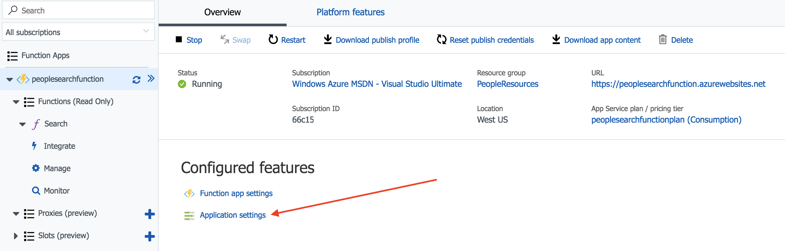

[Azure Cosmos DB](https://azure.microsoft.com/en-us/services/cosmos-db/) is an exciting new way to store data. It offers a few approaches to data storage, one of which has been mysterious to me - Graph APIs. Cosmos DB has support for dynamic graph api structures and allows developers to use the rich [Gremlin](https://tinkerpop.apache.org/gremlin.html) query syntax to access and update data. When I read the great walk-through article on [docs.microsoft.com](http://docs.microsoft.com) describing how to use [Azure Cosmos DB's Graph API .NET Client](https://docs.microsoft.com/en-us/azure/cosmos-db/create-graph-dotnet) I was really excited how dynamic my data could be in the Cosmos DB Graph API. I'd been looking for some demo subject matter to try out the new [Azure Functions tools for Visual Studio](https://blogs.msdn.microsoft.com/appserviceteam/2017/08/14/azure-functions-tools-released-for-visual-studio-2017-update-3/), so I decided to put these three new ideas together to build an Azure Function that allows a serverless approach to searching a Cosmos DB via the Graph API. 

> **Update**: I've made a few updates below after doing some due dilligence on a dependency-related exception I observed during local debugging. If SDKs evolve I'll update the post and make additional updates in this area of the post. 

## Introducing the Serverless & Schemaless Series

Authoring this post and learning about Graph API was really exciting, and like all good technologists I found myself becoming a little obsessed with the Graph and the opportunities the world of Functions and Cosmos DB has to offer. Functions and Cosmos DB's nature together create a **Serverless & Schemaless Scenario**, and the opportunities this scenario provides for agile developers dealing with evolving structures and processes seem vast. This post is one in what I call the **Serverless & Schemaless Series**:

1. [Querying Azure Cosmos DB's Graph API using an Azure Function](/azure-cosmosdb-with-functions) (this post)
1. [Querying Azure Cosmos DB using serverless Node.js](/azure-cosmosdb-with-functions-and-nodejs) - Walks through creating a Node.js Function that queries Cosmos DB's Graph API using an open-source Gremlin package
1. TBD
1. TBD

## Building a Function using Visual Studio

The article I mentioned earlier, [Azure Cosmos DB's Graph API .NET Client](https://docs.microsoft.com/en-us/azure/cosmos-db/create-graph-dotnet), has a companion GitHub repository containing some great getting-started code. The console application project basically sets up a Cosmos DB database with some sample `person` data. I forked the companion repository into my own fork [here](https://github.com/bradygaster/azure-cosmos-db-graph-dotnet-getting-started), which contains the basic Function code I'll describe below. So if you just want the code and aren't interested my verbose discussion, you can find it [here](https://github.com/bradygaster/azure-cosmos-db-graph-dotnet-getting-started). 

First step should be obvious - we need to add a Function to the solution. 


Once the Function project is created there are a few NuGet related updates and installs we'll need to make. To make sure we're using the latest and greatest Functions SDK, it'd be a good idea to update the `Microsoft.NET.Sdk.Functions` package. 


The Cosmos DB Graph API team was nice enough to give us a .NET Client SDK, so we should use it. Use the handy NuGet tools to install the `Microsoft.Azure.Graphs` package. 


During debugging, I noticed a few runtime errors that indicated the `Mono.CSharp` assemblies couldn't be found. I presume this has something to do with the emulated environment, but don't quote me on that. I followed up [Donna Malayeri](https://twitter.com/lindydonna), one of the awesome Program Managers on the Functions team to get some details here, thinking the reference might indicate a `func.exe` issue or potential emulator variance. She confirmed there's no dependency on `Mono.CSharp` in the Functions emulator. 

So then I checked in with [Andrew Liu](https://twitter.com/aliuy8), one of the awesome Program Managers in the Cosmos DB team. He confirmed that one of the dependencies in the Cosmos DB SDK is `Mono.CSharp`. My debugging experience did error with this dependency mentioned during a Graph API call, come to think of it. 

> I mention all these great folks not to name-drop, but so you know how to find them if you have questions, too. They're super receptive to feedback and love making their products better, so hit them up if you have ideas. 

Either way - to debug this guy locally you'll need to install the `Mono.CSharp` package. 


Once the dependencies are all in place (see the NuGet node in the Solution Explorer below for *what-it-should-look-like*), we'll need to write some code. To do this, add a new Function item to the project. I've named mine `Search.cs`, since the point of this Function will be to provide database searching. 


The Function will respond to HTTP requests, so the **Http Trigger** template is appropriate here. We want this Function to be "wide open," too, so we'll set the **Access rights** menu to be **Anonymous**, which lets everyone through. 


Once `Search.cs` is added to the Function project, add these using statements to the top of the file. 

```csharp
using Microsoft.Azure.Documents;
using Microsoft.Azure.Documents.Client;
using Microsoft.Azure.Documents.Linq;
using Microsoft.Azure.Graphs;
using Microsoft.Azure.WebJobs;
using Microsoft.Azure.WebJobs.Extensions.Http;
using Microsoft.Azure.WebJobs.Host;
using System;
using System.Collections.Generic;
using System.Configuration;
using System.Linq;
using System.Net;
using System.Net.Http;
using System.Threading.Tasks;
```

Once those have been added, replace the Function's class code with the code below. The code will simply search the Cosmos DB database using the Graph API for either *all* the people, or for the *specific* person identified via the `name` querystring parameter. 

```csharp
public static class Search
{
    static string endpoint = ConfigurationManager.AppSettings["Endpoint"];
    static string authKey = ConfigurationManager.AppSettings["AuthKey"];

    [FunctionName("Search")]
    public static async Task<HttpResponseMessage> Run(
        [HttpTrigger(AuthorizationLevel.Anonymous, "get", "post", Route = null)]HttpRequestMessage req,
        TraceWriter log)
    {
        log.Info("C# HTTP trigger function processed a request.");

        // the person objects will be free-form in structure
        List<dynamic> results = new List<dynamic>();

        // open the client's connection
        using (DocumentClient client = new DocumentClient(
            new Uri(endpoint),
            authKey,
            new ConnectionPolicy
            {
                ConnectionMode = ConnectionMode.Direct,
                ConnectionProtocol = Protocol.Tcp
            }))
        {
            // get a reference to the database the console app created
            Database database = await client.CreateDatabaseIfNotExistsAsync(
                new Database
                {
                    Id = "graphdb"
                });

            // get an instance of the database's graph
            DocumentCollection graph = await client.CreateDocumentCollectionIfNotExistsAsync(
                UriFactory.CreateDatabaseUri("graphdb"),
                new DocumentCollection { Id = "graphcollz" },
                new RequestOptions { OfferThroughput = 1000 });

            // build a gremlin query based on the existence of a name parameter
            string name = req.GetQueryNameValuePairs()
                .FirstOrDefault(q => string.Compare(q.Key, "name", true) == 0)
                .Value;

            IDocumentQuery<dynamic> query = (!String.IsNullOrEmpty(name))
                ? client.CreateGremlinQuery<dynamic>(graph, string.Format("g.V('{0}')", name))
                : client.CreateGremlinQuery<dynamic>(graph, "g.V()");

            // iterate over all the results and add them to the list
            while (query.HasMoreResults)
                foreach (dynamic result in await query.ExecuteNextAsync())
                    results.Add(result);
        }

        // return the list with an OK response
        return req.CreateResponse<List<dynamic>>(HttpStatusCode.OK, results);
    }
}
```

The code is basically the same connection logic as in the original console application which seeded the database, with a simple query to retrieve the matching records. 

## Debugging the Function Locally

Now that the code is complete, the Functions local debugging tools and emulator can be used to run the code locally so we can test it out. 

Before the code will run properly, it must be configured for local execution with the Cosmos DB connection information. The `local.settings.json` file can be used to configure the Function for local execution much in the same way the `App.config` file is used to configure the original console application for execution. 


Once the Function app has been configured locally so it knows how to find the Cosmos DB database, hitting `F5` will launch the local debugging tool (which probably has the funkiest name of all time), `func.exe`, with the Function code hosted and ready for use. 

At the end of the initial output from `func.exe`, I'll see that my Function is being hosted at `localhost:7071`. This will be helpful to test it in a client. 


To test my Function, I'll use [Visual Studio Code](http://code.visualstudio.com) with Huachao Mao's excellent extension, [REST Client](https://marketplace.visualstudio.com/items?itemName=humao.rest-client). REST Client offers local or remote HTTP request capability in a single right-click. I'll add the URL of my person search function and execute the HTTP request. 


I'm immediately presented with the raw HTTP response from the locally-running Function! Headers, JSON body content, everything.


By adding the `name` querystring parameter with a value I know to be in the database, I can filter the results the Function returns. 


Once the Function is validated and seems to be working properly, the last step is publishing it to Azure App Service and configuring it to run in the cloud. 

## Publishing the Function to Azure

Luckilly, publishing is nearly a single mouse-click. By right-clicking the project I can see the familiar **Publish** context menu item. 


I'm ready to publish this to the Cloud so it can be tested running in a publicly available scenario. So I'll select the first option, **Azure Function App** and enable the **Create New** radio button here so I can create a brand new Function in my Azure subscription. 


The publish panel opens next, allowing me to name my Function. I'll opt for creating a new Consumption-based App Service Plan since I intend on using the pay-per-use billing method for my serverless Function. In addition, I'll create a new Storage Account to use with my Function in case I ever need support for Blobs, Tables, or Queues to trigger execution of other functionality I've not yet dreamed up. 


Clicking the **Create** button in the dialog will result in all the resources being created in my Azure subscription. Then, Visual Studio will download a publish profile file (which is a simple XML file) that it'll use for knowing how to publish the Function code the next time I want to do so. 

Once the Function is published, I can flip to the Azure Portal blade for my Function. There, I'll see a link to the Function's **Application settings**. I'll need to go here, as this is where I'll configure the live Function for connectivity to the Cosmos DB database with my Person data. 



Just as I did earlier in the console application's `App.config` file and in the Function app's `local.settings.json` file, I'll need to configure the published Function with the `Endpoint` and `AuthKey` values appropriate for my Cosmos DB database. This way, I never have to check in configuration code that contains my keys - I can configure them in the portal and be sure they're not stored in source control. 


Once the Function is configured properly in my Azure subscription, I can again use the Visual Studio Code REST Client extension to query my publicly-available Function URL. 


## Summary

This post summarized how to write a basic Azure Function to search a super-small Cosmos DB database using the Graph API, but there's so much more opportunity here. I enjoyed this quick-and-dirty introduction to using Cosmos DB and Functions together - it really drives home the flexibility of using a serverless back-end together with a schemaless data storage mechanism. These two tools are powerful when used together, to enable really rapid, fluid evolution of an API that can evolve around the underlying data structure. 

I'll definitely be investigating Cosmos DB and Azure Functions together for some upcoming side project ideas on my backlog, and encourage you to take a look at it. The [sample code in my fork of the repository](https://github.com/bradygaster/azure-cosmos-db-graph-dotnet-getting-started) - though kind of brute-force still - demonstrates how easy it is to get up and running with a serverless front-end atop a Graph database with worldwide distribution capability. 