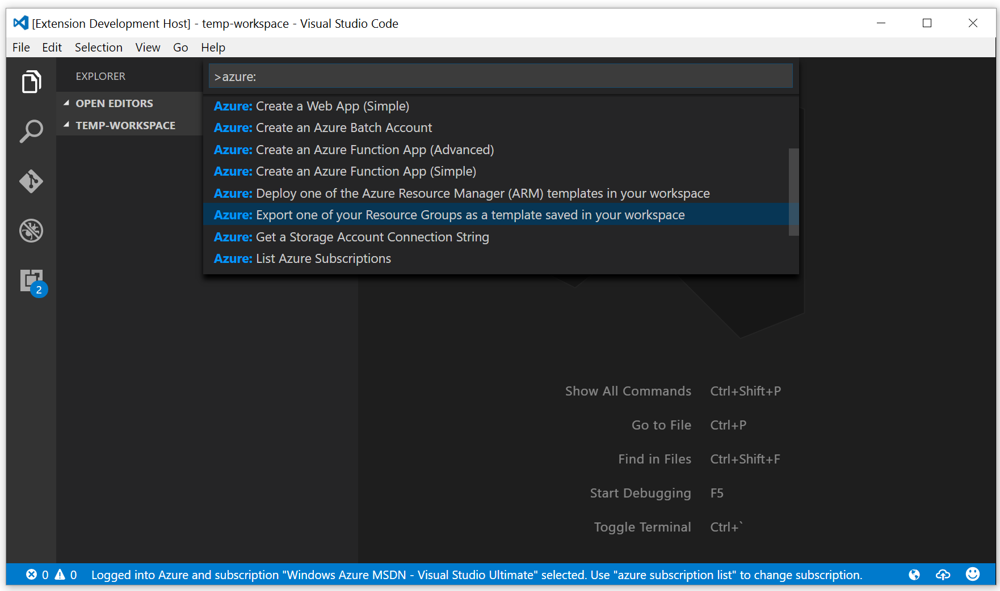
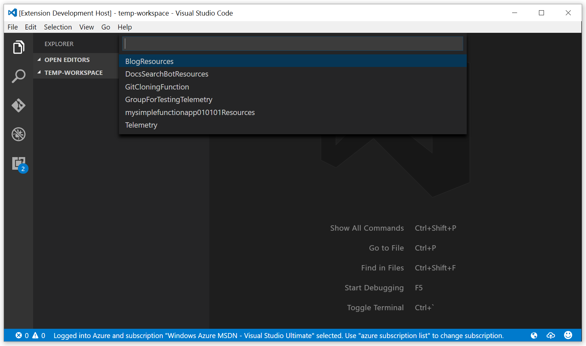
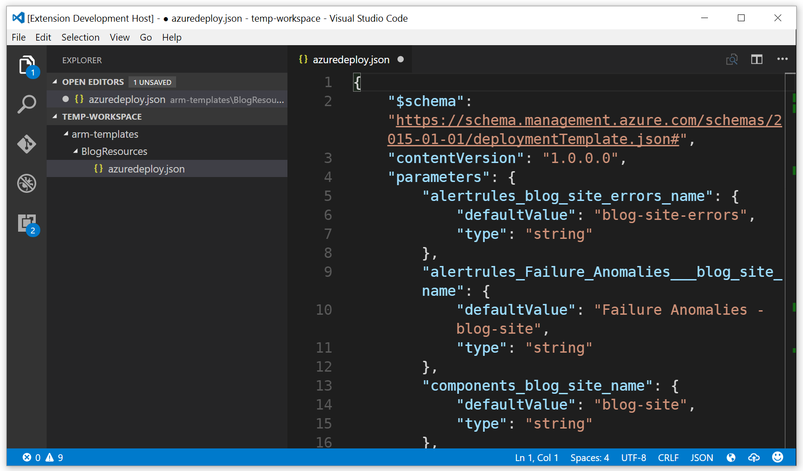
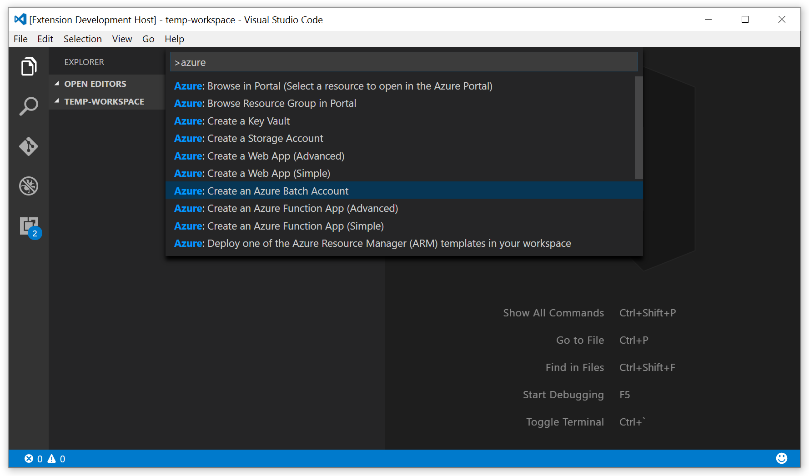
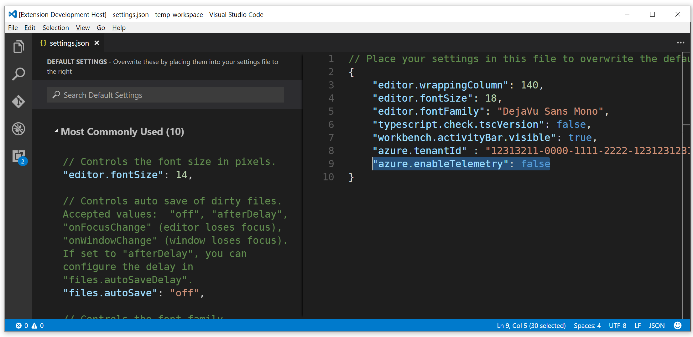

Today you can download the new version (v1.2.0) of the [Azure Tools for Visual Studio Code](http://aka.ms/vscodeazuretools) (ATVSC). A team of contributors have collaborated, [responded to issues](https://github.com/bradygaster/azure-tools-vscode/issues?q=is%3Aissue+is%3Aclosed) reported on our [public GitHub repository](https://github.com/bradygaster/azure-tools-vscode), and spent some time cleaning up some of the less-than-desirable early code in the extension to make contributions more easy and isolated. This post will describe the new features in v1.2.0. In addition to a doing some refactoring to ease extension contributions, we've added a ton of new features in this version. 

## Export Template

In 1.2.0 we've added support for exporting existing resource groups to ARM templates saved in your workspace. First, you invoke the `Export` command using the palette. 

Then you select an existing resource group. 

A few seconds later, the resource group's contents are downloaded as an ARM template and stored into your current workspace's `arm-templates` folder. 

> **Note:** As of the 1.2.0 release time frame there are a few kinks in the particular Azure API call we're using; certain details of your resources might not be persisted exactly right. You can use the great features contained in the [Azure Resource Manager Tools extension](https://marketplace.visualstudio.com/items?itemName=msazurermtools.azurerm-vscode-tools) (which bundled with this extension) to make tweaks. The API owners are working on making great improvements to this functionality so it'll improve in future releases of the back-end API.

## Azure Batch account creation
[Christos](https://twitter.com/ChristosMatskas) [Matskas](https://cmatskas.com/), a colleague and fellow Azure speaker rich in the arts of FOSS contributions submitted some great features like Key Vault in 1.1.0, and he continued to contribute in 1.2.0, adding support for Azure Batch. 

From within Visual Studio Code you can use the `Create Azure Batch` command from the palette, shown below, to create new Azure Batch accounts. Future releases may add support for scripting against your Batch account, creating Jobs, and so forth. Feel free to send the team requests for additional Batch features via our [GitHub Issues page](https://github.com/bradygaster/azure-tools-vscode/issues).

## Telemetry Collection
This release introduces the collection of basic usage telemetry. We're using Application Insights to collect and understand how customers are using the extension. To disable the collection of telemetry data simply edit set the `azure.enableTelemetry` configuration setting to `false` as shown below. 

> Note: No performance degradation has occurred during this addition, and no private customer information is being persisted. [Our telemetry code](https://github.com/bradygaster/azure-tools-vscode/blob/master/src/telemetry.js) tracks the name of the call being made (like `CreateAppService`) and the GUID-based subscription id being affected. We capture the subscription ID so we can understand the frequency of customer usage; the ID can't be used to reversely-identify customers. No customer-identifying data, passwords, connection strings, or resource names are being persisted to our telemetry system. 

## Existing Features
You can learn more about the ATVSC in the [initial announcement post](/posts/announcing-azure-tools-for-visual-studio-code) or on the [ATVSC marketplace page](http://aka.ms/vscodeazuretools). Here's a bullet list of the other features the tools provide to make it easy for developers to party in the cloud. 

- Azure Key Vault Creation
- Search the [Azure QuickStart Templates](https://github.com/Azure/azure-quickstart-templates) GitHub repository
- Download Azure Resource Manager (ARM) template and parameter files to workspace
- Uses the [Azure Resource Manager Tools](https://marketplace.visualstudio.com/items?itemName=msazurermtools.azurerm-vscode-tools) extension to simplify the template-editing experience
- ARM template deployment to live Azure subscription
- Login with Microsoft Account (@hotmail.com, @live.com, etc.)
- Login with Azure Active Directory (or "Organizational") account
- Create App Service Web Apps
- Create App Service Function Apps
- Create Storage Accounts
- Get Storage Account connection string
- Browse to resource in portal
- Browse to resource group in portal
- Support for multiple Azure subscriptions
- Supports all Azure data centers

## Thanks!
Thanks for taking the time to learn about all the new features we've put into the ATVCS. If you're a Visual Studio Code user, take a moment to try the tools out. Send us a GitHub issue if you have any ideas. Your votes or comments are also welcome on the marketplace site, if you're finding the tools useful. 

Happy coding!