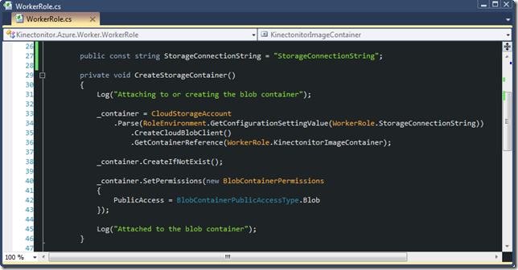
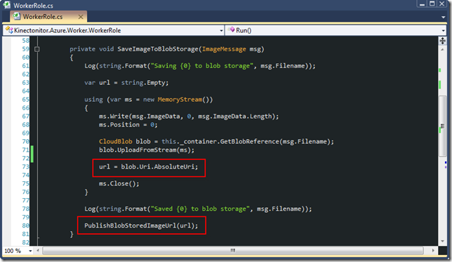
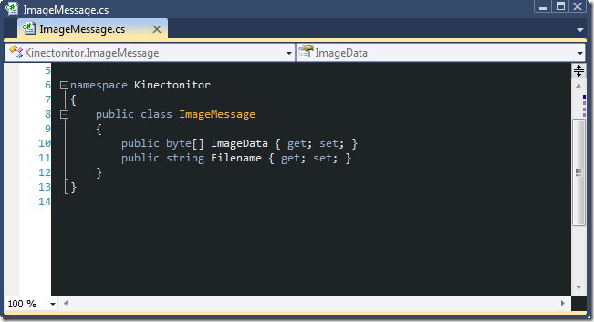
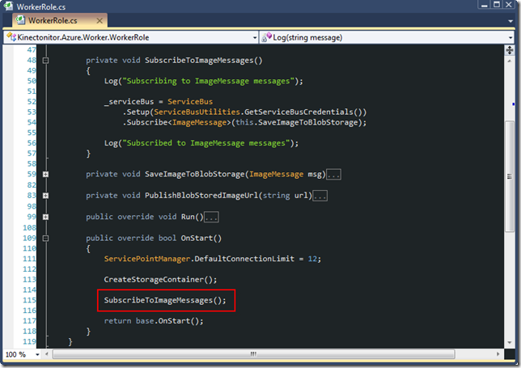
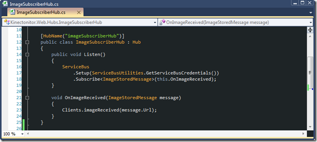

The Kinectonitor has received a lot of commentary and I&#x2019;ve received some great ideas and suggestions on how it could be improved. There are a few architectural aspects about it that gave me some heartburn. One of those areas is in that, I failed to make
  use of any of Azure&#x2019;s storage functionality to store the images. This post sums up how Blob Storage was added to the Kinectonitor&#x2019;s architecture so that images could be stored in the cloud, not on the individual observer site&#x2019;s web servers. 

<blockquote>
  

    So we&#x2019;re taking all these pictures with our Kinect device. Where are we storing the images? Are they protected by disaster recovery procedures? What if I need to look at historical evidence to see photos of intruders from months or years ago? Where
      will all of this be stored? Do I have to worry about buying a new hard drive for all those images?
  

</blockquote>

A legitimate concern that can be solved by storing the photographs taken by the Kinect into the Azure cloud. The video below shows a test harness I use in place of the Kinect device. This tiny application allows me to select an image from my hard drive.
  The image content is then sent along the same path as the images that would be captured and sent into the cloud by the Kinect. This video demonstrates the code running at debug time. Using
  <a href="http://clumsyleaf.com/products/cloudxplorer">ClumsyLeaf&#x2019;s CloudXplorer</a>  client I then show the files as they&#x2019;ve been stored in the local development storage account&#x2019;s Blob storage container. 

<iframe height="315" src="http://www.youtube.com/embed/XYwdbn0D5Fk" frameborder="0" width="560" allowfullscreen></iframe>

Now we&#x2019;ll take a slightly deeper dive into the changes that have been made in this update of the Kinectonitor source code. If you&#x2019;d like to grab that code it is
  <a title="The Kinectonitor Source on GitHub" href="https://github.com/bradygaster/Kinectonitor">available on GitHub</a> .

The Kinectonitor Worker Role

This new project basically serves the purpose of listening for <em>ImageMessage</em>  instances. There&#x2019;s not a whole lot of code in the worker role. We&#x2019;ll examine its purpose and functionality in more detail in a moment. For now, take a look at the role&#x2019;s
  code in the Object Browser to get a quick understanding of what functions the role will provide the overall Kinectonitor architecture. 

   

In the previous release of the code, <em>ImageMessage </em> instances were the only things being used to pass information from the Kinect monitoring client, to the Azure Service Bus, and then back down to the ASP.NET MVC client site. This release of the
  code simplifies things somewhat, especially around the service bus area. The previous code actually shipped the binary data into <em>and </em> out of the Azure Service bus; obviously this sort of arrangement would make for huge transfer rates. Before,
  the communication was required because the images were being stored in the ASP.NET MVC site structure as image files. Now, the image data will be stored in Azure Blob Storage, so all the ASP.NET MVC client sites will need is the URL of the image to
  be shown to the user in the SignalR-powered HTML observation client. 

If you haven&#x2019;t yet taken in some of the great resources on the Microsoft Azure site, now would be a great time. The
  <a title="How to use the Blob Storage Service" href="http://www.windowsazure.com/en-us/develop/net/how-to-guides/blob-storage/">introductory how-to on Blob Storage</a>  was quite helpful in my understanding of how to do some of the Blob Storage-related functionality. It goes a good deal deeper into the details of how Blob Storage works, so I&#x2019;ll refer you to that article for a
  little background.

The worker role does very little handiwork with the Blob Storage. Basically, a container is created in which the images will be saved, and that container&#x2019;s accessibility is set to public. Obviously the images in the container will be served up in a web
  browser, so they&#x2019;ll need to be publicly viewable. 

   

The <em>SaveImageToBlobStorage</em>  method, shown below, does the work of building a stream to use to pass the binary data into the Blob Storage account, where it is saved permanently (or until a user deletes it). 

   

Note how the <em><a title="MSDN Documentation on the CloudBlob.Uri Property" href="http://msdn.microsoft.com/en-us/library/windowsazure/microsoft.windowsazure.storageclient.cloudblob.uri.aspx">CloudBlob.Uri</a>  </em> property exposes the
  URL where the blob can be accessed. In the case of images, this is quite convenient &#x2013; all we need to be able to display an image is its URL and we&#x2019;ve got that as soon as the image is saved to the cloud. 

Simplifying the Service Bus Usage

As previously mentioned, the image data had been getting sent not only <em>to </em> the cloud, but out of the cloud and then stored in the folder tree of an ASP.NET MVC web site. Not exactly optimal for archival, definitely not for long-term storage. We&#x2019;ve
  solved the storage problem by adding in the Blob Storage service, so the next step is to clean up the service bus communication. The sole message type that had been used between all components of the Kinectonitor architecture in the first release was
  the <em>ImageMessage </em> class, shown below. 

   

Since the <em>ImageMessage</em>  class is really only needed when the need exists to pass the binary content of the image, a second class has been added to the messaging architecture. The <em>ImageStoredMessage</em>  class, shown below, now serves the purpose
  of information the SignalR-driven web observation client that new images have been taken and saved into the cloud. 

   

With the added event concept of images being stored and the client needing to only know the URL of the last image that&#x2019;s shown automatically in the browser, the message bus usage is in need of rework. When the worker role spins up, the service bus subscription
  is established, as was being done directly from within the MVC site previously. The worker role listens for messages that come from the Kinect monitor.

   

When those messages are received, the worker role saves them to Blob Storage using the <em>PublishBlobStoredImageUrl</em>  method that was highlighted earlier. 

   

Finally, one last change that will surely be augmented in a later revision is within the SignalR hub area. Previously, Hubs were wired up through a middle object, a service that wasn&#x2019;t too thoroughly implemented. That service has been removed, and the
  Hubs are wired directly to the service bus subscription. 

   

Obviously, this results in all clients seeing all updates. Not very secure, not very <em>serviceable </em> in terms of simplicity and customer separation. The next post in this series will add some additional features around customer segmentation and subscription,
  as well as potential authentication via the bolted-on Kinect identification code. 

