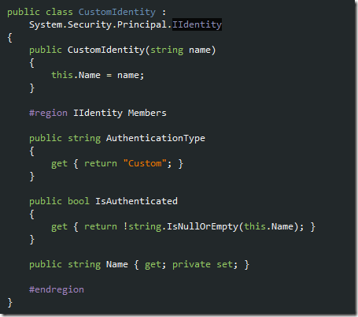
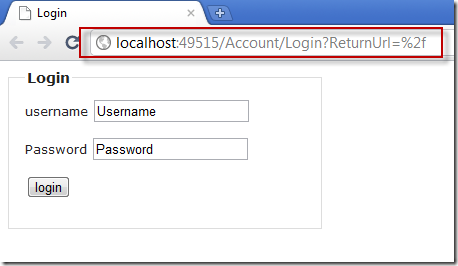

During a friendly code review discussion a week or so ago I realized I&#x2019;d forgotten my favorite lore of custom authentication/authorization functionality in lieu of ASP.NET P&amp;M. Though I definitely prefer P&amp;M to rolling my own from scratch to the extent
  that I&#x2019;ve gone as far as to use it as a pass-through there are some times when P&amp;M is too much &#x2013; or too little &#x2013; so custom schemes must be developed. The thing that surprises me each time I observe a custom scheme is the lack of usage of the IPrincipal/IIdentity
  interfaces. With MVC 3.0 as my major weapon of choice in web development and my recent adoption of P&amp;M, it became obvious that an opportunity had popped up for mixing my favorite old-school .NET trick into my favorite new-school paradigm.

<blockquote>
  
Here&#x2019;s the thing. If you don&#x2019;t use the IIdentity and IPrincipal interfaces when you create a custom authentication/authorization solution you&#x2019;ve completely missed the boat and I guarantee you you will write 100 times more code, that will be more brittle,
    than you would have ever written had you just used them in the first place.

</blockquote>

  

A quick look into what these two interfaces offer is in order. The graphic above sums it up visually. You&#x2019;ll see that the IIdentity interface is typically considered a requirement for the IPrincipal to exist; obviously this model fits in rather well with
  MVC&#x2019;s favoritism to IoC/DI practices.&#xA0; The principal wraps around the identity, supplying access to a user&#x2019;s roles. So long as your classes implement the requirements, they can be bound to the HTTP Context, the current thread, basically attached the
  process so that all the niceties like use of the [Authorize] attribute and role-based location security via the web.config file are possible without tons of rework.

&#xA0;

The first class needed in any custom implementation is the identity class. The main purpose of this implementation is to represent the user&#x2019;s name, really, as well as how the user was authenticated and if they <em>are </em> authenticated. Should the <em>IsAuthenticated </em> property
  be set to false at run-time, code later on assumes the user is an anonymous user.

   

Next will be the <em>CustomPrincipal </em> class. Since this class implements <em>IPrincipal, </em> it can be used to bind itself directly to a thread (or an HTTP Context). Since it can be used in that manner, all the functionality and support offered via
  web.config-based authorization, use of the [Authorization] attribute, all of that &#x2013; it will be maintained and you won&#x2019;t have to write it (or support it, or debug it, and so on). Note how the constructor&#x2019;s argument is highlighted to illustrate the connection
  between the two classes.

  

To wrap these classes up via a native event handler or inherited method we&#x2019;ll create a <em>BaseController</em> . It could &#x2013; and probably should &#x2013; be done via an injected service, obviously, but I&#x2019;m honoring the KISS principle [you <em>say principle, I say principal</em> ]
  for the purposes of this walk-thru. The base controller is shown below and its main purpose in existing &#x2013; to authorize the active user account prior to allowing execution of the controller action.

  

<strong>Caveat: This next part isn&#x2019;t a recommendation, it&#x2019;s only used for the purposes of keeping this explanation simple. Forgive me. </strong> 

Now that we&#x2019;ve satisfied the authorization part we&#x2019;ve got to authenticate the user and store their login information somewhere for the life of their&#x2026; yeah, you guess it, <em>for the life of their session. </em> We&#x2019;re going to use <em>Session </em> here,
  okay, but just for the demo. It isn&#x2019;t a recommendation. Please turn <em>off </em> the tape recorder.

The <em>SimpleSessionPersister</em>  class below persists the user&#x2019;s name into a session variable [ducks under flying tomato]. The login controller action below the utility class just validates that the user provided <em>something </em> for their username
  and password and, if so, the user&#x2019;s username is persisted to session for use &#x2013; by the <em>BaseController, </em> specifically &#x2013; later during the HTTP request.

  

<strong>You can relax now, that part&#x2019;s over. </strong> 

Now that the user has been authenticated we can assume that each controller we create (provided it inherit from our custom base) will authorize each individual request per the best-practice role-base security means. Take the following controller action
  below, which requires the user be authenticated via the [Authorize] attribute and the web.config, also below, which indicates the login page URL as our Login controller action.

  

Should a user try to hit the non-anonymous page they&#x2019;d be redirected to the login page (see the URL highlighted below).&#xA0;

  

To review the process we went through to accomplish our very own custom-made end-to-end security paradigm that still allows usage of the .NET built-in role-based security resources, here&#x2019;s what we had to do:

<ul>
  <li>Implement the IIdentity interface in a custom class</li>
  <li>Inherit from the IPrincipal interface in a custom class</li>
  <li>Create a way to authenticate the user</li>
  <li>Create a way to persist the authentication information [a.k.a. <em>username</em>  in this example]</li>
  <li>Override the <em>OnAuthorization </em> method in a base controller and then use that base controller in future controllers</li>
</ul>

Happy Coding! If you&#x2019;d like to take a peek at the code for this demo and debug it for better observation as to how it all works together
  <a href="http://dl.dropbox.com/u/3597725/MVCCustomAuthSample.zip">you can download the code from my DropBox account</a> .

