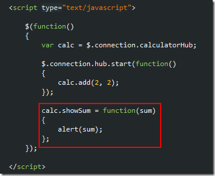
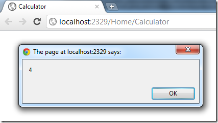
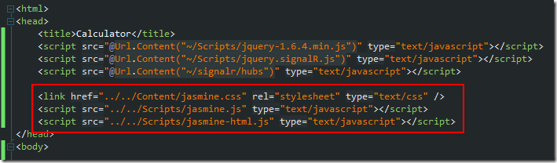
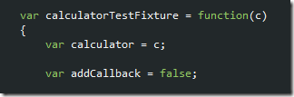
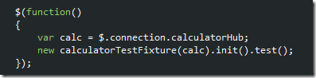
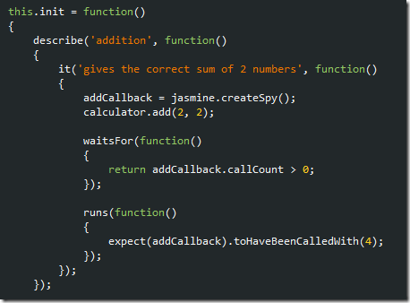
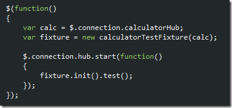
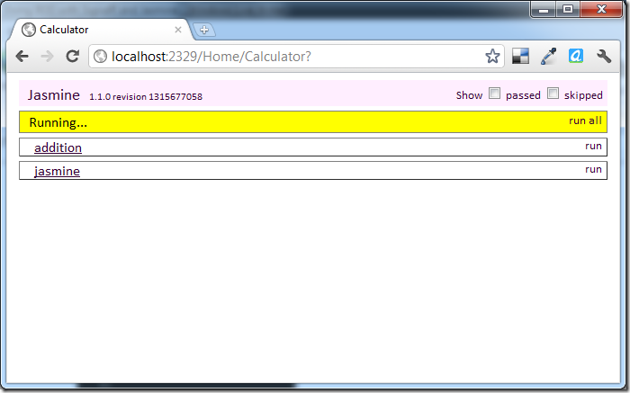
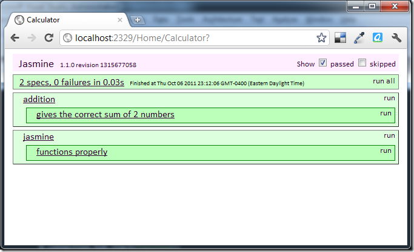

SignalR is one of the latest (and sexiest) elements in the .NET stack. Expect to hear more about SignalR if you haven&#x2019;t already, because it delivers on the promise of push technology without the requirement of a fat client. If you&#x2019;ve not yet read much
  about SignalR,
  <a title="SignalR was originally developed within Microsoft, is hosted on GitHub, and is completely and totally open source." href="https://github.com/SignalR/SignalR">clone the source code from GitHub</a>  or read
  <a title="I mean, come on. You gotta trust this guy." href="http://www.hanselman.com/blog/AsynchronousScalableWebApplicationsWithRealtimePersistentLongrunningConnectionsWithSignalR.aspx">Scott Hanselman&#x2019;s post on SignalR</a>  for an introduction. The scope and inner-workings of SignalR are somewhat out of scope here, so I&#x2019;ll just assume you&#x2019;ve at least heard <em>something </em> about SignalR and that you&#x2019;re interested in it but have a
  few questions. I mean, if you&#x2019;re into BDD/TDD, you should definitely be wondering:

<blockquote>
  

    So how testable is SignalR? If the magic of it is based in some form of maintained connection, the implication of how one has to code asynchronously against it makes testing p-r-e-t-t-y difficult. Testing in JavaScript is pretty difficult to begin
      with, so now what?
  

</blockquote>

There&#x2019;s this amazing TDD/BDD micro-framework called
  <a title="Jasmine is a behavior-driven development framework for testing your JavaScript code" href="http://pivotal.github.com/jasmine/">Jasmine</a>  that lends itself extremely well to all sorts of different JavaScript problem domains. I learned about Jasmine from some colleagues in the Ruby community, then found some
  <a title="Pragmatic JavaScript Testing with Jasmine" href="http://blog.carbonfive.com/2011/07/06/pragmatic-javascript-testing-with-jasmine/">pretty</a> 
  <a title="Testing Your JavaScript with Jasmine" href="http://net.tutsplus.com/tutorials/javascript-ajax/testing-your-javascript-with-jasmine/">awesome</a> 
  <a title="How do I verify jQuery AJAX events with Jasmine?" href="http://stackoverflow.com/questions/4662641/how-do-i-verify-jquery-ajax-events-with-jasmine">resources</a>  on Jasmine, and have been waiting for an opportunity to try it out. This seemed like a perfect opportunity, so I dove in.

The Calculator SignalR Hub

This example will offer a solution to the simple problem of providing basic numeric calculations. Obviously, the first operation most users will need is some addition functionality.

  

The implementation of this method might look a little strange if you&#x2019;re new to SignalR. It&#x2019;ll make sense in just a moment when you see the corresponding JavaScript code. Think about it this way; the Clients property of any Hub is <em>dynamic</em>  object
  that will represent a corresponding JavaScript method on each of the clients connected to the Hub. 

  

The controller action for the client has no special glue or magic in it. It&#x2019;s basically a shell to adhere to the requirement of having an action for the views. 

  

On the client, there will be a few script references to make sure SignalR works properly. 

  

This is the part where the dynamic client thing should make sense. The JavaScript code below demonstrates how to call this dirt-simple SignalR Hub and to generate some action on the client. 

  

The call earlier, within the implementation of the Hub, is basically a way of the server telling the client, <em>would you please run this method and pass it this data? </em> It isn&#x2019;t a really sexy example when you see it execute, of course, but it drives
  the point home. <em>SignalR makes push ridiculously simple. </em> 

  

Bring on the BDD!

As if SignalR isn&#x2019;t nifty enough, Jasmine gives us the ability to set up specifications and unit tests to make sure things are working properly and to guide development. Now, we get to put them together to answer the problem of <em>how to test the client. </em> (I&#x2019;m
  not knocking other methods, like WaTiN or other automated testing implementations, here, this is just another way of skinning the same kitty.)

We&#x2019;ll need to include the basic script references and CSS file to make Jasmine light up. You can download those from the
  <a title="Jasmine standalone downloads" href="http://pivotal.github.com/jasmine/download.html">Jasmine site</a>, or they&#x2019;re included in the
  <a title="My GitHub SignalR.Demo repository." href="https://github.com/bradygaster/SignalR.Demo">GitHub repository</a>  I&#x2019;ve created for the purpose of my continued tinkering in SignalR. 

  

Once the Jasmine files are in place, it doesn&#x2019;t hurt to create a pulse-check specification to make sure the glue&#x2019;s dry. The JavaScript object shell below will be a roadmap for how we&#x2019;ll solve this problem. 

  

Once the specifications have been written up, Jasmine&#x2019;s environment is created and the tests are executed. 

  

If you&#x2019;ve pinned the tail on the donkey to this point, the results should be quite self-explanatory when you view the calculator page again. If you don&#x2019;t see the tests, check the <em>passed </em> checkbox and the passing test will appear. 

  

At this point, to test that the SignalR <em>CalculatorHub</em>  is communicating with the client properly all that&#x2019;s <em>really </em> needed is a way to call the <em>Add </em> method from in a unit test and to verify that the JavaScript code&#x2019;s <em>showSum </em> method
  executed with a parameter of 4. 

The first step in getting this working is to modify the test fixture class so it can be supplied any dependencies it might have. In this case, we plan on testing the calculator hub, so it&#x2019;ll be passed into the fixture in it&#x2019;s constructor. Also added is
  the <em>addCallback </em> field. At this point it&#x2019;ll be set to <em>false, </em> but the plan is, to set this variable to the callback method that will be called when the calculation is completed by the hub.

  

Since the constructor&#x2019;s changed it&#x2019;d be wise to change the calling code, our jQuery <em>ready </em> method. This time, we&#x2019;ll go ahead and create an instance of the SignalR <em>CalculatorHub </em> and it&#x2019;ll be provided as a construction argument. 

  

Next, a new specification is added to the <em>init </em> method. This specification is the unit test that will demonstrate the calculator&#x2019;s being called properly from the client JavaScript. 

  

It&#x2019;d help at this point to take a
  <a title="The Matchers section is really the important part here. You don&apos;t need to KNOW this, just have an idea of it and a reference bookmark." href="https://github.com/pivotal/jasmine/wiki/Spies">peek at the Jasmine Wiki article on Spies</a>  to get an idea of how this sort of verification can be accomplished. Jasmine&#x2019;s Fluent syntax makes it pretty self-explanatory (and including vsdoc files to provide Intellisense in Visual Studio brings in
  the Jasmine methods). Jasmine, like Moq and other mocking frameworks, offers unit tests the capability of checking to see if methods have been executed properly.

  

If your Jasmine tests are executed at this point, you&#x2019;ll see some <em>p-r-e-t-t-y</em>  interesting results. For about 5 seconds the browser will let you know something&#x2019;s happening by making the current test&#x2019;s background color yellow. 

  

Then the test will complete execution and fail. Jasmine is assuming via those calls earlier assume they should wait for an asynchronous response and if it doesn&#x2019;t arrive, the tests will fail. They fail because the callback methods are never executed,
  <em>and the tests expect them to be</em> . 

  

That <em>addCallback </em> field that was added to the test fixture is how this can be accomplished. The client&#x2019;s <em>showSum </em> method is the one thing that&#x2019;s been omitted from the JavaScript code. That&#x2019;s the method that the SignalR hub will try to
  call on each client whenever it needs to do so.

  

Within the test fixture resides the <em>onAdd </em> method. It just executes the fixture&#x2019;s <em>addCallback </em> method and feeds it the results from the SignalR <em>CalculatorHub </em> call. 

  

Once that&#x2019;s all wired up, the test should pass!

  

If you&#x2019;re obsessive about verifying, just change the expected value to be something wrong and re-run the test. Obviously, if the math fails, so should the test. Otherwise it&#x2019;d be a pretty useless calculator!

  

Recap

SignalR and Jasmine work quite nicely together. If you apply a little OO elbow grease and take the time to wire things up with callbacks and to verify the execution of those callbacks, SignalR can be tested rather effectively. All it takes is to properly
  stage, and then verify, that the Hub&#x2019;s method is called and that, when the Hub fires the client callback, that the callback is executed as your code expects it to be executed. 

Thanks for taking the time to stop by. Happy Coding!

