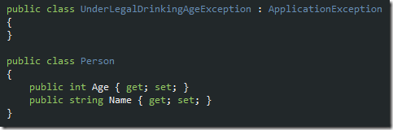
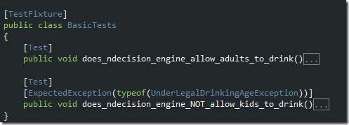
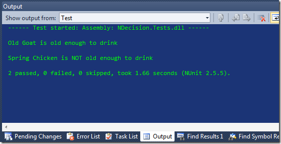

This post serves a dual purpose, to add to the list of articles in the series on Generics and Reflection. It also introduces a Fluent business logic processor I&#x2019;ve built about 100 times in other incantations but I think all eventually leading up to this
  point. In keeping with my current trend of hypercomplicating the sublime by making giving it a Fluent interface to make it easy for reuse later on, the result was, as my friend Bill Hargett would probably say, is an object-oriented way of representing
  a procedure. Pretty much. So that&#x2019;s our goal statement.

<blockquote>
  
Represent the relationship between an object and the steps it takes through a system or the actions on which a process acts out on that object as a series of disconnected objects. Expose the ability to use that decisioning power via a Fluent interface. Use business language-rich unit tests to provide guidance on the manner in which the processes should be executed.  

</blockquote>

Typical late-night insomnia fodder. Thank goodness for Generics, for they make the whole engine and core architecture of this idea possible in about 200 lines of code. Maybe less.

To get started take a look at the super-simple business entity and exception. You can probably figure out what the business logic looks like. We&#x2019;ll spell it out in provable statements:

<ol>
  <li>Allow all users 21 or over to drink</li>
  <li>Disallow all users under 21 to drink</li>
</ol>

  

Taking that logic and rolling unit tests is pretty easy.

  

Given those tests we have a rather common language from which a Fluent interface can be created. Handle a target instance or list of instances using associated method calls. Why method calls and not interfaces? That&#x2019;d force too much structure. You could
  have one old app with all the&#xA0; methods you need, just not glued together properly. You refactor a little, tie it all together, and use something like NDecision to direct traffic.

  

With the unit tests defined and a little imagination and patience applied the Fluent interface takes a structure that makes the business rules quite easy to implement. The test out put is below. you&#x2019;ll see both tests pass in spite of the fact that the
  result behavior of the underage run is an exception is thrown; it&#x2019;s just one the test is actually is expecting.

  

If you&#x2019;re interested in this, let me know and I&#x2019;ll get you a copy of the code. It is pretty short and is probably going to be shown in a future post, so stay tuned.

