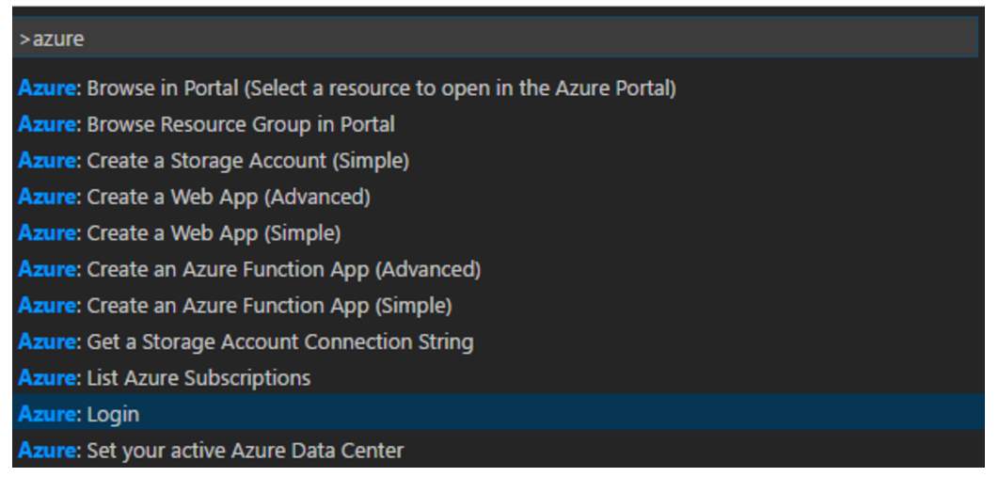
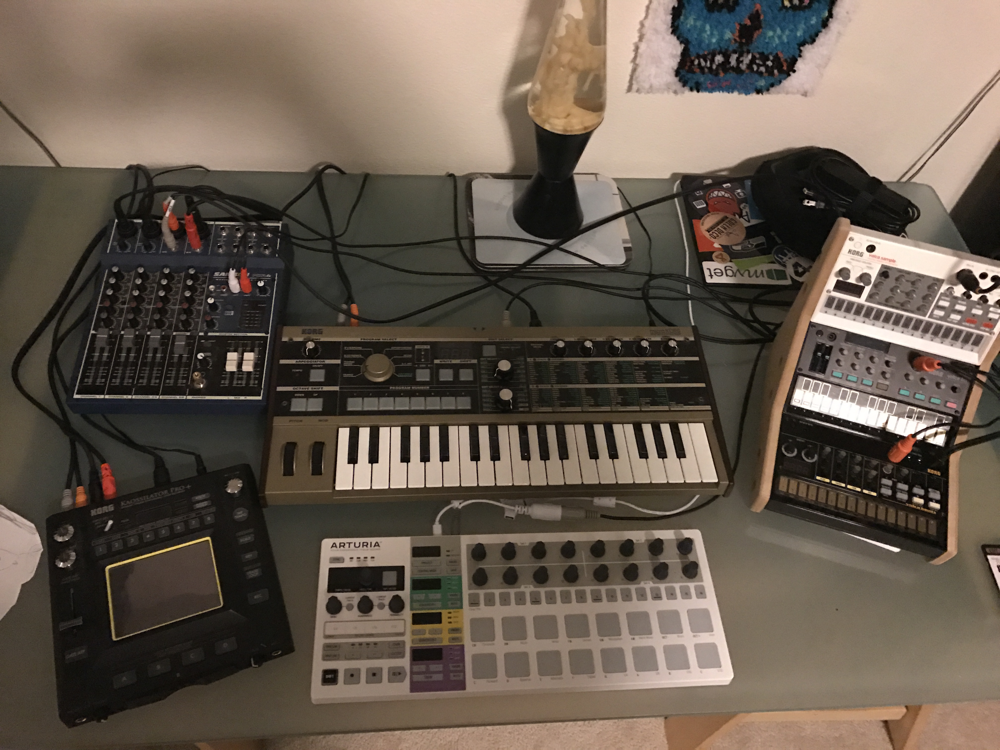

Over the past however-many months this blog has been inactive in spite of the volume of my activity. One could argue that the blog failed to emulate life but instead suffered from it. A few folks asked me why I'd been so quiet, so I wanted to answer that question. The post evolved into a recap of the past year. Even more, it provided a cathartic first post using a new blog engine I'll tell you more about in a moment.

## What have I been working on?
I haven't *not been busy*. Here's a quick run-down of what I've been up to since my last post. 

### Visual Studio App Service Tools
I helped design and implement a number of changes to the Visual Studio Azure App Service Tools extension and helped customers and partners understand the opportunities these tools provide by speaking at a few conferences and writing a few release blog posts as we churned out numerous SDK releases. 

### docs.microsoft.com
Though I truly enjoyed the tooling world a great opportunity opened up in the [docs.microsoft.com](http://docs.microsoft.com) team working with some of my heroes and I changed roles. Together we're changing the way Microsoft does documentation. It hasn't been easy, but it has been rewarding to work in the team that inspired me when I was a graduate student reading MSDN SiteBuilder every week. Since I've joined the team I've been helping overhaul numerous reference experiences for topics such as:

* [.NET Core API](http://docs.microsoft.com/dotnet/core/api)
* [Azure Python SDK](http://docs.microsoft.com/cli/azure)
* [Azure Java SDK](http://docs.microsoft.com/java/api)
* [Azure .NET SDK](http://docs.microsoft.com/dotnet/api)
* [Azure REST API](http://docs.microsoft.com/rest/)

Here I am with my my new teammate [Rob Eisenberg](https://twitter.com/eisenbergeffect) (I'm so not worthy of these colleagues and constantly suffer from impostor symdrome) in our fancy team room:

## Azure Tools for Visual Studio Code
I created the [Azure Tools for Visual Studio Code](http://aka.ms/vscodeazuretools) extension using Node.js and the Azure Node.js SDK. Two of my goals for 2017 are to improve the Node.js reference documentation for the Azure SDK *and* to learn more about [Visual Studio Code](http://code.visualstudio.com) extension development. So late in 2016 I created this extension in the hopes of forcing myself to learn Node.js and to use the existing documentation from the perspective of a truly n00b customer so I could better ask our awesome developers on the team to make a great Node.js SDK documentation experience. Below is a screen shot of the commands made available using the extension. 

In the last weeks of 2016 started working on a new blogging engine. More on this in a moment. 

## How's the family and Seattle going? 
One of the other reasons I've been so busy is that my family and I have thoroughly been enjoying the Puget Sound Area, Seattle, and all the amazing sights and natural majesty the area offers:

In addition to all the work I've been doing I've also been *familying* and **really enjoing it**. Our first few years in the area were - well - *weird*, but we've gotten stronger out of it and really work together as a great team.

As if the global news, radical uptick in people-you-grew-up-with dying in 2016, and the stresses of work and personal life weren't enough, I had some personal tragedies as well. My father died, as well as a few other family members. It wasn't easy, but in the case of my dad, neither would be watching someone I love suffer for much longer. 

In spite of the numerous explosions of the year it was an amazing year of change in our family and we're optimistic about the future. We moved into a cute little neighborhood after living on a scarily busy street and life has been a lot better as a result. The entire family has gotten involved in soccer, so we have numerous matches each week. Mostly indoor. Yes, it does rain here a little, but in spite of that it is an amazing and beautiful place to live and the whole family has been finding new people and places to enjoy. 

## I've gotten into MIDI
Since my last post another thing that's taken a ton of time has been that I've gotten back into producing music at home and have learned a lot about MIDI and how to use it to create music. By omitting a computer from the recording and creative process altogether I was forced to learn more about using the actual devices and building a decent rig of hardware. This has become quite a passion, as has been coming up with strange new sounds in the home office. 

One of my failed goals for the year was to write a blog series on these devices, how I made the decisions I made, and how to make interesting things happen with your devices. Again, the blog was neglected, even though I so badly wanted to sit down and write about it I got blocked each time. 

## I wrote a new blog engine using ASP.NET Core and Markdown
The truth is, I've been fickle with blog engines because I've been using blog engines written by other people who have different goals. My last engine, [Miniblog](https://github.com/madskristensen/MiniBlog), has far and away been my favorite. It is so convenient with a simple-to-use WYSIWYG editor in the browser, and even supports Live Writer. I can't say anything bad about MiniBlog, but we had to break up. It isn't MiniBlog, it's me. You see, I'm a creature of habit and I finally admitted I prefer the way I blog using Markdown and git to the way MiniBlog enabled me to blog. I realized my enjoyment of writing on my personal blog had been waning because everything about the writing process was different from what I'd gotten used to. The worst part was that I have a ton of work-related pet projects like the [Azure Tools for Visual Studio Code](http://aka.ms/vscodeazuretools) extension and my MIDI tinkering, but my engine kept getting in my way. So, I started working on [downr](/posts/introducing-downr).

Most of the blogging and content publishing tools I use at work make use of Markdown. The open-source engine we use for [docs.microsoft.com](http://docs.microsoft.com), [DocFX](http://github.com/dotnet/docfx), makes great use of Markdown, and our publishing systems support it. Additionally, Markdown is my medium of choice for all my open-source projects. 

Some friends had also told me about [Ghost](https://ghost.org/), but it seemed a little too large for a single developer blog's need. There are numerous awesome options out there that would enable my desired workflow, but it seemed there wasn't anything that would be precisely what I was after written in ASP.NET Core. Though I've demonstrated a ton of ASP.NET Core things and done a ton of Web API work, I'd not built a custom site or web app in some time. I'd also wanted to do something a little more interesting with [Grunt](http://gruntjs.com), so I took the opportunity of a greenfield project to use it to automate the build. 

So in the final hours of my holiday vacation, I set out to create a blogging engine that **I would use**. I took inspiration from the tools and processes I use at work but made things a lot simpler and geared towards bloggers than comprehensive documentation. Then I converted my blog to use it and wrote a converter to migrate my content to my new engine. This blog is now using the [downr](http://github.com/bradygaster/downr) engine, which you can learn more about in my [Introduction to downr](/posts/introducing-downr) post. 

## 2017 will be awesome
The turn of each year always offers promise and hope, and this year's turn is probably the most glaring example of this in recent memory for me. 

We have some amazing new projects and ideas for documentation in the team and we've refined our process, made improvements to our tools, and have some new ideas for documentation next year that are sure to be exciting. 

My pet projects - the [Azure Tools for Visual Studio Code](http://aka.ms/vscodeazuretools) and the new [downr](/posts/introducing-downr) blogging engine - are also great outlets for me to try the products I work to make easy to use for our customers. 

Good luck to you in the new year!