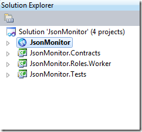
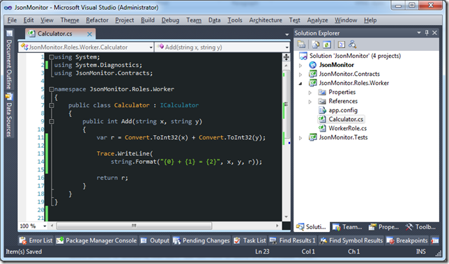
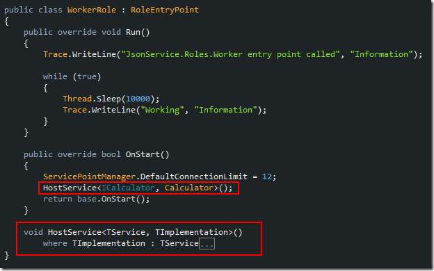
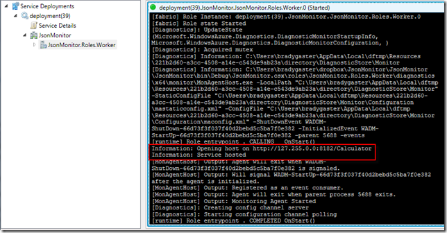
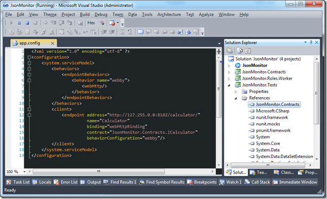
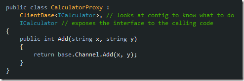

Developers need to grok Azure, especially developers who want to distribute consumption of an application in a web-based API. A great use for Microsoft Azure, obviously, is to use it to host an application&#x2019;s web service API layer. This post will demonstrate
  how to host WCF services in an Azure worker role in a manner that will offer REST-like JSON API support.

WCF Can do JSON, and it isn&#x2019;t Difficult

I promise. Most of the examples you&#x2019;ll see cover possibly <em>too much </em> of the configuration specifics and focus on how Visual Studio can generate proxies for you. Though that&#x2019;s a great facet of the IDE, there are some natural limitations to comprehending
  the moving parts within WCF if you always let the IDE take care of the plumbing. Once you get into implementing JSON services in WCF, the IDE generation can actually make things more difficult. If you&apos;d like to follow along in the Visual Studio solution
  you can
  <a href="http://dl.dropbox.com/u/3597725/JSON-WCF-Azure.zip" title="Download the code for this article">download it here</a> .&#xA0;

To start with, here&#x2019;s a snap shot of the Visual Studio solution. Each project should be relatively self-explanatory in purpose. Each will be examined in a moment.

  

At this point, a closer examination of each project is in order. Don&#x2019;t worry, there&#x2019;s not a lot to each project. This won&#x2019;t take long. You&#x2019;ll be amazed how easy it could&#x2019;ve been the whole time and even more amazed how easy it is to get your JSON API&#x2019;s
  into Azure.

Service Contract and Implementation

This example will be a simple and familiar one; the service layer will expose calculator functionality. Hopefully, a later blog post will go into more detail on complex messaging, but for now, a calculator serves the explanation well.

The screen shot below demonstrates the <em>ICalculator </em> service interface. Note it has been decorated with the typical service model attributes, as well as the <em>WebInvoke </em> attribute. Within the <em>WebInvoke</em>  attribute&#x2019;s constructor, JSON
  is being used as a request and response style.

   

This attribute code simply says &#x201C;when the application hosts this service, use JSON as the serialization syntax.&#x201D; It&#x2019;ll be important that those attributes are on the interface later on in this post. For now, just take a look at the implementation in the
  screen shot below.

   

As you&#x2019;ve seen, the service contract interface is not only where the abstraction is defined, but how the service is used from within WCF. The next piece of the puzzle is how the service will be hosted within a Azure worker role process.

Hosting WCF JSON Services in Azure

There are a number of great resources on StackOverflow or CodeProject on the details of hosting a WCF service in Azure, so this article won&#x2019;t dive too deeply into the intricacies. Rather, this next section will dive right in and get things done.

WCF Services can be hosted in numerous ways. A few options are available via Azure, from hosting in a typical web application environment to being hosted and configured manually in a Worker Role. The code below demonstrates the second option via a worker
  role class.

   

The important method, <em>HostService</em>  is closed in the screen shot above, as it&#x2019;ll be examined in somewhat more detail below. The <em>HostService </em> method does just what it says &#x2013; it hosts a WCF service implementation
  as represented by a decorated WCF interface in the Azure worker role.

   

This method just declares a new <em>ServiceHost </em> instance, then sets that instance up on the <em>WebHttp </em> binding so that JSON communication can take place. In particular, the code requires one step of configuration take place. The code that looks
  at the Worker Role environment&#x2019;s end points collection is shown below.

   

This stipulates a convention. That each service endpoint will be named in the endpoints configuration according to it&#x2019;s type&#x2019;s name. In this example case, the <em>Calculator </em> class is the one that&#x2019;ll actually be placed on the WCF binding. The screen
  shot below demonstrate how and in which file this can be set using Visual Studio 2010.

   

At this point, the worker role should be configured and ready to run. If the project is run in debug mode at this point the computer emulator will open and the trace output is visible. The screen shot below shows the compute emulator running. The highlighted
  sections are the custom trace messages the code writes at run-time.

   

The final step is to write a client to consume the service while it is being hosted in Azure.

Calling via a Unit Test

This service only exposes one small unit of functionality, so it stands to reason a unit test could be a good method of testing the service. Sure, it&#x2019;s test-after, but that argument is for another time! For now, let&#x2019;s finish this example up by calling
  the WCF service being hosted in Azure. Just to prove there are no smoke and mirrors, here&#x2019;s what the URL from the compute emulator will expose when suffixed with the <em>UrlTemplate </em> format from the <em>ICalculator </em> service definition from earlier.

   

To know about the service, the unit test project will have a reference set to the contracts project. So that the unit test will know how to call the service in the cloud, the unit test project will need a tiny bit of configuration added to it&#x2019;s <em>app.config</em>   file. The screen shot below demonstrates both of these steps.

   

I mentioned early on that this post would demonstrate proxy formation without the use of the service references functionality of Visual Studio. The class below demonstrates how this can be achieved. By inheriting from the <em>ClientBase </em> class
  and the interface being exposed by the service, you can create a custom proxy class in a minimal amount of work.

   

Finally, the unit test can be authored.

   

When executed, provided the calculator service is being hosted in Azure, the results should be immediate. The test passes, the result of the calculation yielding a correct result.

   

Looking back at the compute emulator that was running when the unit test client was executed, the evidence the service is handling requests is apparent. The screen shot below highlights a pair of executions from when the test was executed.

   

Summary

This article took a no-nonsense approach to demonstrating how simple it is to host JSON-serialized WCF services in Azure. Azure is an amazing resource for developers who want to expose aspects of their application in open web API&#x2019;s. Hopefully, this example
  has demonstrated how easy it is to get started doing just that. Soon, you&#x2019;ll be RESTing in the Cloud, with your very own WCF JSON API&#x2019;s.&#xA0;

  <a href="http://dl.dropbox.com/u/3597725/JSON-WCF-Azure.zip" title="Download the code for this article">Download the Visual Studio.NET solution for this article.</a> &#xA0;

