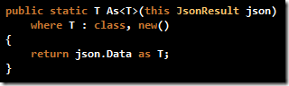
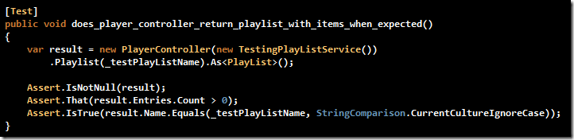

Mildly silly and maybe making too many assumptions though it is, I worked up a little extension method to generically evaluate (and return) the Data property of a JsonResult class. Makes life a little easier when testing JsonResult action methods on controller
  instances.

  

Helps during testing, for sure. See below for a demonstration of how I&#x2019;m using this in a pet project.

  

