
This is the first post in the
  <a href="http://www.bradygaster.com/solving-real-world-problems-with-windows-azure-web-sites">Real World Problems with Azure Web Sites blog series</a>, as it intends to answer one of the most common questions I receive when I&#x2019;m doing presentations about Azure Web Sites. This situation demonstrates a typical setup, wherein a site owner has multiple
  environments to which they push their web site. This setup is extremely valuable for staging site releases and for delivering solid web applications or for doing A-B testing of a site&#x2019;s changes. In order to make sure your changes are okay, it helps
  to have a staging and production environment to use to make sure things are good before one makes their changes live in a production environment. My good friend and colleague Cory Fowler
  <a href="http://blog.syntaxc4.net/post/2012/11/17/continuous-deployment-in-windows-azure-web-sites.aspx">blogged about continuous deployment with Azure Web Sites</a>, and my other good buddy Magnus Martensson did a
  <a href="http://channel9.msdn.com/Events/WindowsAzureConf/2012/A05">great presentation at Windows AzureConf on the topic</a> . I&#x2019;ve done countless demonstrations of continuous deployment with Web Sites, but one question always comes up, that this post intends to answer. 

<blockquote>
  
That&#x2019;s all well and good and I know I can deploy my site automatically each time I make a change, but that&#x2019;s not realistic. 

  
&#xA0;

  
It&#x2019;s like, if I use Azure Web Sites to host my site, it&#x2019;ll be deployed each time I check in code &#x2013; even when I didn&#x2019;t want to deploy the site. 

  
&#xA0;

  
How do I control what gets deployed and control the deployment and maintain quality?

</blockquote>

That&#x2019;s a great question, and it&#x2019;s one that most have struggled to answer. It&#x2019;s also a barrier for many who are thinking of using Azure Web Sites but who don&#x2019;t want to manage their site like they&#x2019;re running their company out of a garage. This &#x201C;happy path&#x201D;
  deployment mantra isn&#x2019;t real-world, especially for site owners who want to stage changes, test them out, and be certain their changes won&#x2019;t cause any problems following a hasty deployment process. 

Multiple Sites for Multiple Environments

As with any multiple-environment setup, the first thing I need to do to support having multiple environments is to create multiple sites in Azure Web Sites. Using the portal, this is quite simple. The screen shot below shows you what this would look like.
  Note, I&#x2019;ve got a &#x201C;real&#x201D; site, that&#x2019;s my production site area, and I&#x2019;ve also added a staging site to the account. 

   

In particular, take note of how both of these sites are in the &#x201C;free&#x201D; tier. Let&#x2019;s say you&#x2019;ve got a production site in the &#x201C;non-free&#x201D; zone because you want to map your domain name to it, scale it up or out, or whatever else. I&#x2019;ll leave my staging site
  in the free tier and not incur any charges on it. 

Why is this important? <strong>Because I won&#x2019;t need to pay anything additional for having multiple sites</strong> . Since most users won&#x2019;t have the staging URL, or it won&#x2019;t matter what it is since it&#x2019;ll just be for testing purposes, I don&#x2019;t need to map
  a domain name to it, scale it, or anything like that. It&#x2019;s just <em>there</em>  for whenever I need to do a deployment for testing purposes or verification purposes. This setup won&#x2019;t require you to spend any more money. 

Using GitHub.com for Continuous Deployment

In this example, I&#x2019;ll be using GitHub.com to manage my source code. You don&#x2019;t have to use GitHub.com for this, so if you&#x2019;re new to Git don&#x2019;t freak out, you have other options like CodePlex, BitBucket, or TFS. Heck, you could even automate an FTP deployment
  if you want to.

The first step in setting up GitHub.com integration with a web site is to load up the site&#x2019;s dashboard and to click the Quick Link labeled &#x201C;Set up Git publishing&#x201D; as is illustrated in the screen shot below.
   

  <a href="/Media/Default/Windows-Live-Writer/4e473fe17420_73EE/image_6.png">
    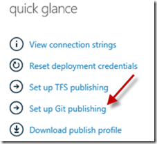
  </a> &#xA0;

Once the repository setup completes, the portal will allow me to specify what type of Git repository I want to connect to my site. I&#x2019;ll select GitHub.com from the list of options, as you&#x2019;ll see below. 

   

If this is the first time I&#x2019;ve tried to connect a GitHub.com repository to a web site, I&#x2019;ll be asked to allow the partnership to take place. 

   

By clicking the <strong>Allow</strong>  button, I let GitHub.com know I&#x2019;m okay with the partnership. The final step in tying a repository to a site is to select the repository I want to be associated with the site, which you&#x2019;ll see in the screen shot below.
  

  <a href="/Media/Default/Windows-Live-Writer/4e473fe17420_73EE/image_8.png">
    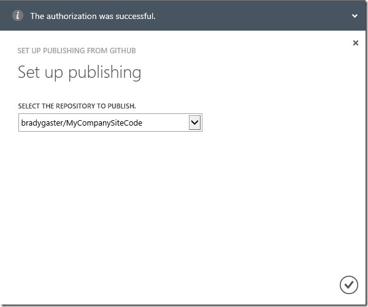
  </a> 

I&#x2019;ll repeat this process for the staging site, too, and I&#x2019;ll associate it with the exact same repository. This is important, as I&#x2019;ll be pushing code to one repository and wanting the deployment to happen according to which site I want to publish. 

Two Sites, One Repository? Really?

Sounds weird, right? I&#x2019;ve got two sites set up now, one for the production site, the other for the staging site, but I&#x2019;ve associated both sites with the same repository. Seems a little weird, as each time I push code to the repository, I&#x2019;ll be deploying
  both sites automatically. The good part is, there&#x2019;s this awesome feature in Git that I can use to make sure I&#x2019;m deploying to the right spot. That feature is called <strong>branching</strong>, and if you&#x2019;re acquainted with any modern source control management
  product, you probably already know about branching. You probably already use branching to control deviations in your code base, or to fix features and bugs. With Azure Web Sites&#x2019; support for branches, you can use them for environmentally-specific deployment
  practices too. The best part is, it&#x2019;s quite easy to set up, and that&#x2019;s just what I&#x2019;ll show you next. 

Configuring Branch Associations

Before I write any code, I&#x2019;ll need to set up the branch &#x201C;stuff&#x201D; using the portal. To do this, I&#x2019;ll go into my production site&#x2019;s dashboard and click the <strong>Configure</strong>  link in the navigation bar. Scrolling down about half way, I can see that
  the production site&#x2019;s set up to use the <strong>master</strong>  branch. The master branch is the default branch for any Azure Web Site, but as you&#x2019;ll see here, the portal gives me the ability to change the branch associated with an individual web site.
  

  <a href="/Media/Default/Windows-Live-Writer/4e473fe17420_73EE/image_14.png">
    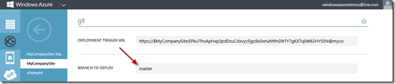
  </a> 

Now, I&#x2019;ll go into my staging site and I&#x2019;ll set the associated branch for that site to <strong>staging</strong> . This means that, each time I check code into the master branch, it&#x2019;ll be deployed to the production site, and each time I check code into the
  staging branch, it&#x2019;ll be deployed to the staging site. 

  <a href="/Media/Default/Windows-Live-Writer/4e473fe17420_73EE/image_12.png">
    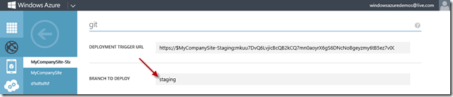
  </a> 

With the setup out of the way I&#x2019;ll be able to write some code that&#x2019;ll be deployed automatically when I need it to be deployed, and to the right place. 

Code, Commit, Deploy

Now that my sites are all configured and pointing to the right branches I&#x2019;ll need to set up local Git repository, write some code, and check that code into the repository. Once that&#x2019;s all done I&#x2019;ll create a second branch called <strong>staging</strong>   that I&#x2019;ll use to push code to my staging site. 

The first step is, obviously, to write some code. I won&#x2019;t do much complicated stuff for this demo. Instead I&#x2019;ll just make a simple MVC site with one view. In this view I&#x2019;ll just put a simple message indicating the site to which I intend to deploy the
  code. 

   

Now, I&#x2019;ll open up Powershell to do my Git <em>stuff.</em>  As
  <a href="http://haacked.com/archive/2011/12/13/better-git-with-powershell.aspx">Phill Haack points out in this epic blog post on the topic</a>,
  <a href="https://github.com/dahlbyk/posh-git">posh-git</a>  is a great little tool if you&#x2019;re a Powershell fan who also uses Git as a source control method. 

  <a href="/Media/Default/Windows-Live-Writer/4e473fe17420_73EE/SNAGHTML52be3f4.png">
    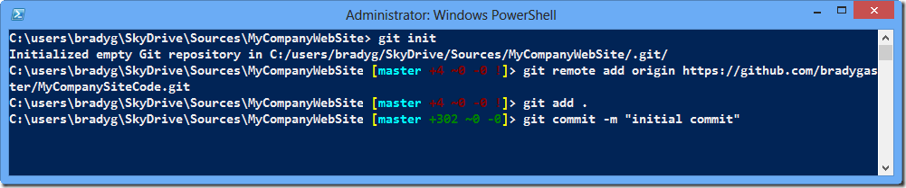
  </a> 

I&#x2019;ll initialize my Git repository using <strong>git init</strong>, then I&#x2019;ll tell the Git repository where to push the code whenever I do a commit using the <strong>git remote add origin [URL]</strong>  command. Finally, I&#x2019;ll use the <strong>git add</strong>   and <strong>git commit</strong>  commands to push all of my changes into my local repository. All of the files in this changeset will scroll up the screen, and when the commit completes I&#x2019;ll push the changes back up to GitHub.com, to the master branch,
  using the <strong>git push origin [branch]</strong>  command. 

   

Once the commit finishes and the code is pushed up to GitHub.com, Azure Web Sites will see the commit and perform a deployment. If you&#x2019;re watching the portal when you do the commit you&#x2019;ll see the deployment take place [almost magically]. 

   

If I click the <strong>Browse </strong> button at the bottom of the portal the site will open up in a browser and I can verify that the change I just committed was deployed. So far, so good. 

  <a href="/Media/Default/Windows-Live-Writer/4e473fe17420_73EE/production-site-up-and-edited_2.png">
    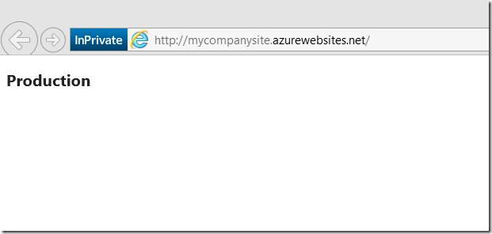
  </a> 

Setting Up the Staging Branch

Now that the production site&#x2019;s been deployed I need to set up the staging environment. To do this, I&#x2019;ll go back into my favorite Git client, Powershell, and I&#x2019;ll create a new branch using the <strong>git checkout &#x2013;b [branch]</strong>  command. This will
  create a new branch in my local Git repository. Then, it&#x2019;ll switch to that repository and make it active. If I type <strong>git branch</strong>  in Powershell, it&#x2019;ll show me all the branches in my local repository. The green line indicates the branch
  I&#x2019;m currently working on. 

  <a href="/Media/Default/Windows-Live-Writer/4e473fe17420_73EE/SNAGHTML53f8690.png">
    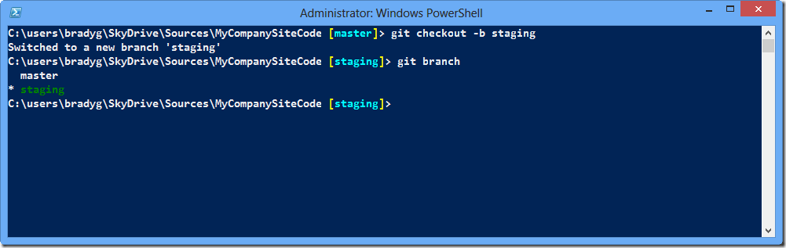
  </a> 

Now that the branch has been created, I&#x2019;ll make some small change in the code of the site. Once this change has been made I&#x2019;ll be pushing it up to GitHub.com again, but this time I&#x2019;ll be pushing it into the newly-created staging branch, so the production
  branch code in the master branch is safe and sound. 

  <a href="/Media/Default/Windows-Live-Writer/4e473fe17420_73EE/image_20.png">
    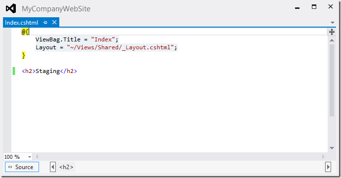
  </a> 

Switching back to Powershell, I&#x2019;ll commit the changes to the staging branch in my local repository. Then, I&#x2019;ll push that code back up to GitHub.com, this time specifying the staging branch in my <strong>git push</strong>  command. 

  <a href="/Media/Default/Windows-Live-Writer/4e473fe17420_73EE/SNAGHTML545785b.png">
    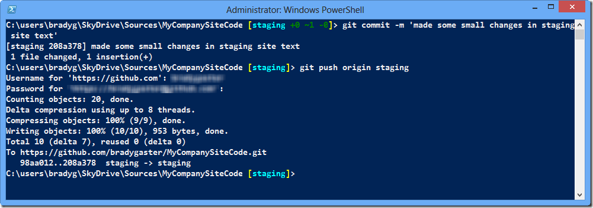
  </a> 

This time, I&#x2019;ll watch the staging site in the portal. As soon as the publish is complete, the portal will reflect that a deployment is taking place. 

   

Once the deployment completes, I can check the changes by clicking the <strong>Browse</strong>  button at the bottom of the portal page. When the staging site opens up, I can see that the changes were pushed to the site successfully. 

   

If go back to the production site, it still says <strong>Production</strong>  on it. Pushing to the staging site didn&#x2019;t affect my production site, and vice-versa. I&#x2019;ve got dual-environment deployments, based on source code branches, and I&#x2019;m able to test
  things out in one environment before pushing those changes to production. Everyone wins!

Local Git Branch Niftiness

One of the neat things about using Git branches (at least it was nifty to me), is that all the code for all the branches is stored in your local repository. Switching between branches automatically results in the source code being restored on your local
  drive. The whole thing happens automatically. Demonstrating how this works is as easy as switching branches while you have a source code file open in Visual Studio. 

So let&#x2019;s say I still have the staging branch set as my working branch and I&#x2019;ve got the source code open up in Visual Studio. If I got to my Powershell client again and switch the branch using the <strong>git checkout [branch] </strong> command, Git changes
  the branch on the fly for me. In so doing, all the files in the local directory are replaced with the files from the newly-selected branch. 

  <a href="/Media/Default/Windows-Live-Writer/4e473fe17420_73EE/SNAGHTML54d7c5b.png">
    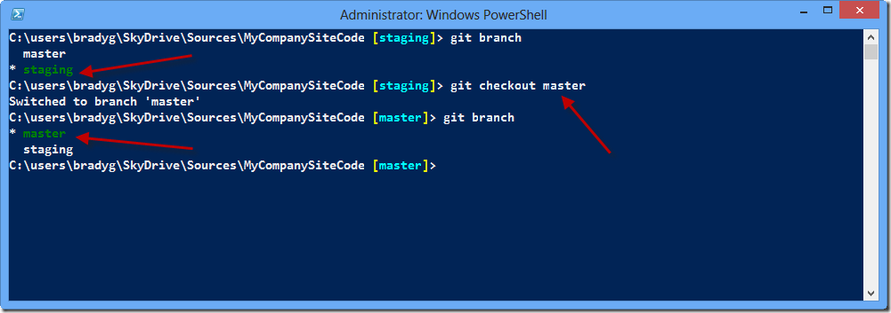
  </a> 

The moment I switch back to Visual Studio, it warns me that the file has changed on disk and asks me if I&#x2019;d like to reload it. 

  <a href="/Media/Default/Windows-Live-Writer/4e473fe17420_73EE/SNAGHTML54e6e2d.png">
    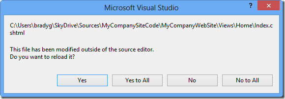
  </a> 

If I click the <strong>Yes </strong> button and then look at my file, I&#x2019;ll see that the file has been changed to the one resident in the new branch. 

   

In this way, Git keeps all the branches of my source code in my local repository, so I can make changes to the branches as needed and then commit those changes back to the local repository. Once I&#x2019;m ready, I can push those files back up to the origin
  (in this case, GitHub.com), and everything&#x2019;s cool.

Summary

Web site environments are a real-world method of controlling, gating, and reverting deployments. Using multiple environments, development shops can make sure their changes took place properly before crashing a production site with poor changes. Azure
  Web Sites is a real-world web hosting platform that can be used to solve real web site challenges. With a little thought and planning, it&#x2019;s easy to use Azure Web Sites to host multiple versions of a web site. Testing can happen live, without affecting
  production deployments. I hope this post has introduced a good method of achieving separate site environments, and that you can see yet another way Azure Web Sites can help you get your site up and running, keep it continually deployed, and reduce your
  concerns over the nature of continuously deploying to a production web site environment using simple tricks like Git branches. 

