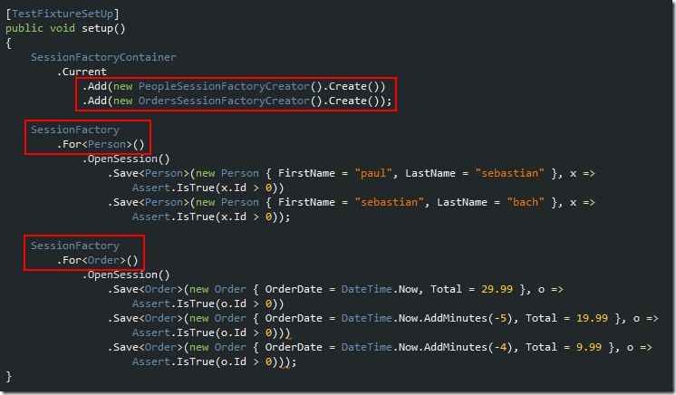
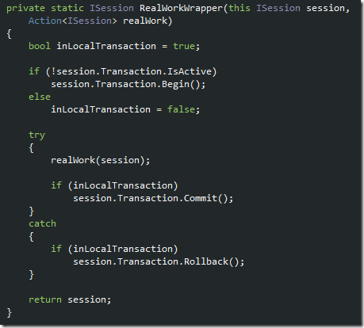

Most of the previous posts have alluded to the multiple-database goal of NHQS and some of the code has demonstrated the beginnings of a demonstration of the feature. This post will take a longer look at how NHQS can provide multiple-database support and
  will wrap up by demonstrating transaction management within NHQS. 

Multiple Database Connectivity

As has been demonstrated in the previous posts&#x2019; unit test setup methods the provision within NHQS for multiple database support relies on the idea that multiple session factories are contained automatically by NHQS, and during that containment associations
  are made between the session factories and the domain entities they service. Take another look at the test fixture setup, which has been modified in this post to provide the initial persistence of testing data. 

  

In this example, recall from the first post, we&#x2019;ll be working with two different domain entity projects, each of which is serviced by its own session factory. Since both session factories are being contained by NHQS, the domain language specifies where
  the objects are sent, and the respective session factories do the rest. 

To further understand how awesome this idea is take a peek at the test project&#x2019;s configuration file. Note how the first of the connection strings points to a SQLCE database, and the second connection string points to a SQL Server 2008 database. So long
  as NHibernate supports the RDBMS you&#x2019;re targeting, NHQS can target it. 

  

The test below completes this section of the multiple-database examination by demonstrating how data from one of the databases tied to the application &#x2013; the Person SQL CE table &#x2013; can be pulled and inserted into a table in another database &#x2013; the Customer
  SQL Server table. 

  

This unit test demonstrates how you could potentially use domain language and NHQS to perform data migrations &#x2013; even when the database platform is completely different. 

Transaction Management

Fans of the <em>Unit of Work </em> pattern/concept will appreciate this section of the post. Those with extensive NHibernate experience understand the idea of managing transactions explicitly rather than just expecting implicit transactions. If you&#x2019;ve
  ever used
  <a title="NHProfiler" href="http://nhprof.com/">NHProf</a>  to profile and trace your NHibernate queries you&#x2019;ll know explicit transaction usage is an area it warns about repeatedly. 

Basically the rule of thumb with NHibernate is that, one should always perform the work of saving, updating, and deleting related entities to an underlying persistence mechanism, in the context of an explicit transaction. Most problems or misunderstandings
  about <em>when does my data truly get saved when I use NHibernate </em> can be mitigated by using explicit transactions. Most generic approaches yield problems when dealing with transactions, so NHQS had a goal of doing its best to allow the developer
  the right to manage their transactions separate to the internal workings of NHQS. 

Take a look at the <em>RealWorkWrapper </em> method within NHQS to demonstrate the way it works. The method peeks at the NHibernate session to see if it is involved in a transaction. If not, it starts its own and does the work. If so, the method just remains
  within that transaction as it does its own work. 

  

One of the NHQS CRUD methods, <em>Save</em>, is pictured below. These two code snippets are not to dive deep into <em>how </em> NHQS works (that would defeat the black-box idea in the first place, right?), but rather to demonstrate how NHQS will either
  use the existing transaction when it exists and if not, how it will create its own. The idea being, to keep inline with an NHibernate best practice recommendation (or to keep inline with my interpretation of it, which is open to review). 

  

Here&#x2019;s the point to that shallow dive. When a developer wants to do something in NHibernate specifically and maybe use NHQS here and there, they have the freedom of doing what they want to do in their own way and to combine NHQS by simply re-using an
  existing NHibernate session. This way, NHQS can be added or removed in-line with your current NHibernate implementation, without having to change a whole lot. Unit-of-work aficionados will appreciate the ability of re-using the transaction for multiple
  database procedures, so that CRUD operations can be grouped together to ensure validity.

  

Examine this unit test and how it would work (and why it would be valid).
  <ol>
    <li>Verify there are no records in the table
      </li><li>Add one person
        </li><li>Add a second person
          </li><li>Verify that two records are in the table
            </li><li>Throw an exception. Since the steps are being performed in a transaction &#x2013; via the <em>DoWithTransaction</em>  call wrapping the unit of work being performed &#x2013; firing the exception will cause avoidance of the transaction&#x2019;s commit method being
              called, so&#x2026;
              </li><li>Verify that no records exist in the database </li>
  </ol>
  
In Conclusion
  
I hope you&#x2019;ve enjoyed this brief encounter with NHQS. As was stated in the original post, it had a few clear goals. I hope NHQS makes your life easier and, if you&#x2019;ve recently embarked into using NHibernate, that it makes that process a little less painful.
    If you have any suggestions, or have extensive experience with NHibernate and find yourself strongly objecting to how NHQS does things, please leave a comment. I&#x2019;m always trying to improve not only NHQS, but my understanding of how NHibernate works.
    

