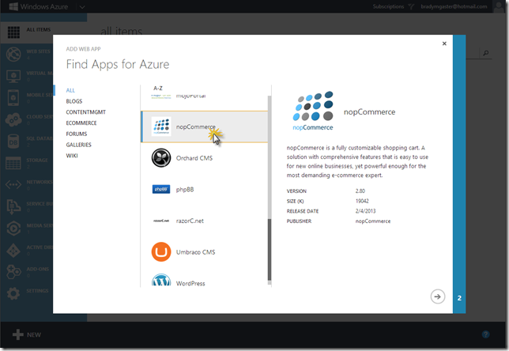
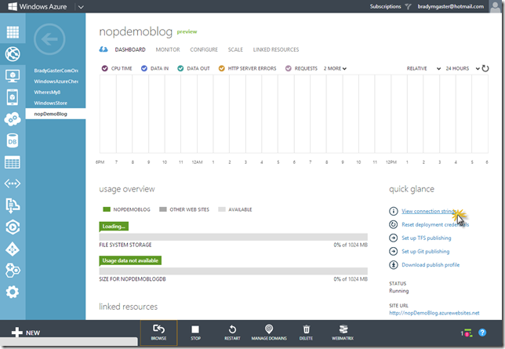
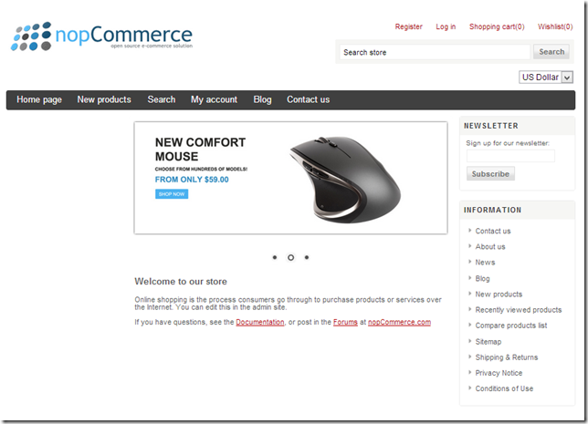
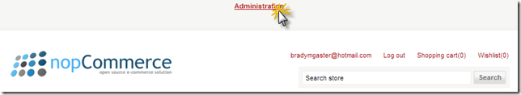
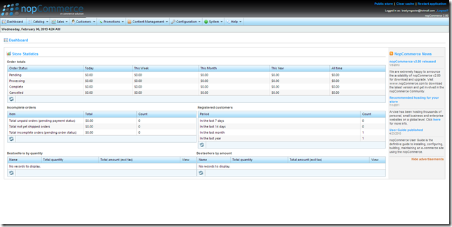

This week we announced support for
  <a href="http://www.nopcommerce.com">nopCommerce</a>  in the Azure Web Sites application gallery. Using the Azure portal and with requiring <em>zero</em>  lines of code, you can set up nopCommerce on Web Sites and get your online store up in minutes. You&#x2019;ll have your very own products database,
  shopping cart, order history &#x2013; the works. On the nopCommerce web site you can learn a lot more about the
  <a href="http://www.nopcommerce.com/featurelist.aspx">features</a>  nopCommerce offers. In this blog post, I&#x2019;ll show you how to get your own store up and running on Azure Web Sites. 

I walked through this process today. As with other entries in the Web Sites application gallery, you really do have to do very little digging to figure out where to go to get started. It&#x2019;s pretty much &#x201C;start, new site, from gallery,&#x201D; as you&#x2019;ll see from
  the picture below. It shows you exactly which menu item to click in the Azure portal to get started. 

   

The next step should be pretty self-explanatory. Select <em>nopCommerce</em>  from the list of available applications. 

   

The next step will ask you for some database connection information. This is what will be set in your nopCommerce installation once the process is complete. I&#x2019;m going to create a new database solely for use with my nopCommerce site I&#x2019;m creating for this
  demonstration. 

   

The next screen is one that appears in a few other application gallery entries, too. It&#x2019;s the &#x201C;where do you want to store your data today?&#x201D; screen. I&#x2019;m creating a new SQL Server database in this screen so I need to provide the database name, specify a
  new server&#x2019;s creation, and provide the database username and password. Don&#x2019;t bother writing this down, there&#x2019;s a
  <strike>n</strike>
  <strike>app</strike> screen for that later in this post. 

   

Once I click OK here, my site is created. First, the portal tells me it&#x2019;s creating the site:

   

Once the site is up and running, Azure lets me know:

   

If I select my nopCommerce site and click the &#x201C;Browse&#x201D; button in the Azure portal, the site will open up in a new browser instance and allow me the capability of specifying the database connection string it&#x2019;ll use. 

   

Now, I&#x2019;ll go back to the Azure portal&#x2019;s dashboard for my nopCommerce demo site. In that dashboard page I&#x2019;ll click the link labeled &#x201C;View connection strings,&#x201D; and a dialog will open. In that dialog I&#x2019;ll see the connection string for my database. I can
  copy that from the dialog&#x2026;

   

&#x2026; and paste it into the nopCommerce setup window.

   

Of course, I&#x2019;ve blocked out my site&#x2019;s <em>real</em>  connection string in this picture, but the idea is &#x2013; <em>it doesn&#x2019;t get much easier. </em> Once I click the &#x201C;Install&#x201D; button in the nopCommerce setup page, the site and database schema, as well as some
  sample data points, will be installed automatically and the site configured to access the database. Once the setup process is complete, I&#x2019;ll be redirected to my very own store site. 

   

In the navigation bar I&#x2019;ll click on the &#x201C;My Account&#x201D; link, login, and then, at the <em>very tip-top</em>  of my browser I&#x2019;ll see a link to get to the Administration panel of my new nopCommerce store site. 

   

The administration portal for the nopCommerce product promises to give me just about everything I&#x2019;d need to sell some stuff, know how my sales are doing, and so on. I can pretty much do whatever I need to do using their rich, extensive administration
  functionality. 

   

If you&#x2019;ve been thinking of setting up a store, with a shopping cart, online, or you&#x2019;ve been asked to do so and are more interested in getting it up and running quickly than you are with re-inventing the wheel by writing custom code, check out nopCommerce.
  Get your free Azure
  <a href="http://bit.ly/windowsazuretrial">trial</a>  &#x2013;
  <a href="http://www.windowsazure.com/en-us/develop/net/aspnet/?WT.mc_id=A5A71FF5F">which comes with 10 free web sites for free</a>  &#x2013; right
  <a href="http://bit.ly/windowsazuretrial">here</a>, then set up your own nopCommerce site and have your products selling in your store. 

