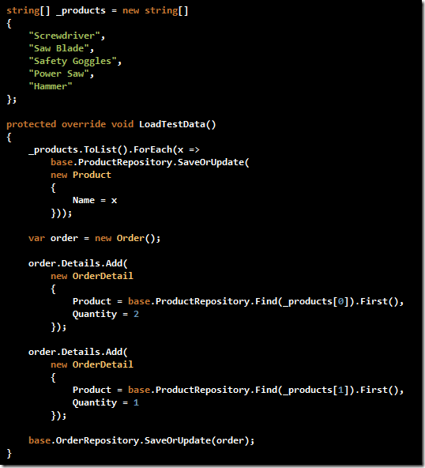
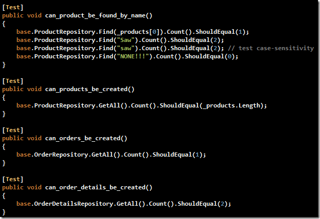
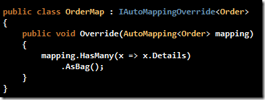
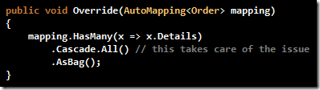
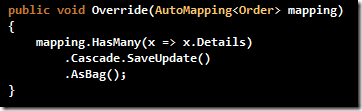

I&#x2019;ve been using [hacking at] NHibernate as my main ORM choice for just over a year and I&#x2019;ve been exceptionally happy with the growing number of projects to augment it&#x2019;s functionality, especially the Fluent NHibernate and LINQ-to-NHibernate contributions.
  NH isn&#x2019;t exactly a simple ORM layer and does have some confusing aspects. One of these aspects &#x2013; at least for me &#x2013; has been that I&#x2019;ve seen inconsistent behavior in the persistence of child collection properties. I think I concluded via a series of unit
  tests this evening for myself how to gain the typical desired outcome and I felt it was something I should share.

Take, for example, the traditional order-to-order-detail relationship. The screenshot below shows a code example of a
  <a title="Plain Old CLR Object" href="http://en.wikipedia.org/wiki/Plain_Old_CLR_Object">POCO</a>  domain object organization exemplifying this sort of relationship. The Product domain object has been included for the sake of completeness for this discussion.

  

Following in typical NHibernate/ORM style I&#x2019;ve created a series of repository interfaces and implementations to provide persistence functionality for these objects; though a discussion of those implementations is somewhat beyond the scope of this article
  I&#x2019;m relatively certain that with a bit of ORM and TDD experience the remainder of this text should still make sense. I tend to use base classes when I&#x2019;m working up my unit tests. The base class below is one that I use in this storefront project example
  that exposes references to local instances of those repositories. Likewise, it inherits from one of the classes provided via the
  <a title="S#arp Architecture" href="http://sharparchitecture.net/">S#arp</a>  architecture, the
  <a href="http://wiki.sharparchitecture.net/ClassLibraries.ashx">RepositoryTestsBase</a>  class.

  

Next is an examination of the TDD setup for this domain object hierarchy. Not too complicated an idea, this is the simplest example of a storefront possible. Products are created, then a sample order is created. To the sample order two products, with
  varying quantities, are added to the order.

  

The unit tests are also as simple as the setup. Each unit test makes sure each item was saved to the persistence layer, and each bases it&#x2019;s pass/fail criterion solely on the data loaded via the method in the figure above.

  

Seems simple enough but when the tests are executed via
  <a title="Thank you, Jamie, for TestDriven.NET" href="http://TestDriven.NET">TestDriven.NET</a>  the tests indicate a failure to save the order details simultaneously when the order is persisted.

  

Now, in the case where you&#x2019;re like me and you want the children to be saved with the parent, this just won&#x2019;t do. If you&#x2019;re of the mindset that each object should be created on it&#x2019;s own in the persistence layer, this might not be so bad. My point is, the
  code below should save both of the order detail records <em>with </em> the order, each time, no matter what.

  

In this case, my problem was in the way I was mapping the relationship between the Order and OrderDetail classes. I&#x2019;m using
  <a href="http://blog.jagregory.com/2009/01/10/fluent-nhibernate-auto-mapping-introduction/">Fluent NHibernate and Auto Mapping</a>, so the changes should be minimal and made within the mapping override for my Order object. The code for my Order mapping override is below.

  &#xA0;

Once I add in the single line informing the mapping that it should cascade all changes via the Cascade.All() method call, the test passes and the order detail records are created alongside the Order.

  

If you&#x2019;re not comfortable with the cascading delete impact this would have the option for cascading only on saves and updates could be a better choice.

  

Happy coding!

