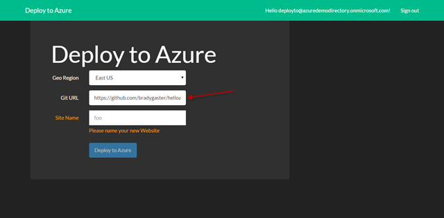
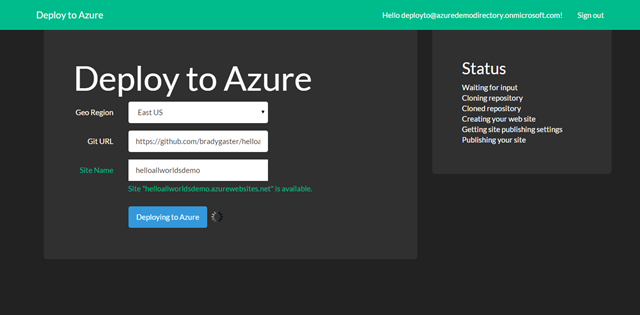
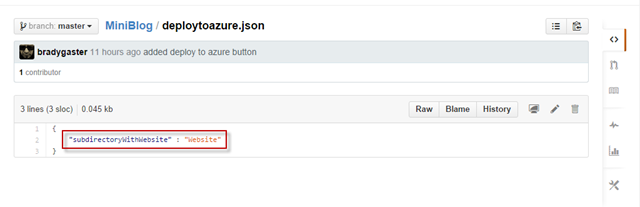

  <b>Update:</b>&#xA0;Two awesome developers from the Azure Websites team,
  <a href="http://blog.davidebbo.com/">David Ebbo</a> &#xA0;and
  <a href="http://azure.microsoft.com/blog/author/ellhamai/">Elliott Hamai</a>, took the idea of Deploy to Azure, looked at the code, laughed and pointed at me, and used all kinds of new APIs in Azure to bring the idea to life in a manner that will provide far more value than I&apos;d imagined. Keep reading to learn
  about the prototype I built, but make sure to
  <a href="http://azure.microsoft.com/blog/2014/11/13/deploy-to-azure-button-for-azure-websites-2/">learn about the real thing</a>, and
  <a href="https://github.com/Tuesdaysgreen/HelloWorlddemo">try it out</a>  yourself.&#xA0;

Over the weekend I received an email from my friend and colleague
  <a href="http://www.devinrader.info/">Devin Rader</a> . In the email he directed me to a neat feature Heroku offers, called the
  <a href="https://blog.heroku.com/archives/2014/8/7/heroku-button">Heroku Button</a>, and asked me if there was anything in the works like this for Azure. I wasn&apos;t aware of anything that was in the works at the time, and given that I&apos;m one of the program managers on the Azure SDK team who builds the
  <a href="https://www.nuget.org/packages?q=microsoft.azure.management">Azure Management Libraries</a>, I figured this was a challenge for which I&apos;d be well-suited. So I replied to Devin to let him know I was inspired by the idea and wanted to build it myself. This blog post will introduce you to the idea of the Deploy
  to Azure Button. My good buddy
  <a href="http://www.cloudidentity.com/blog/">Vittorio Bertocci</a>  has a
  <a href="http://www.cloudidentity.com/blog/2014/10/09/the-use-of-azure-ad-behind-deploy-to-azure/">complementary post</a>  on how the identity flow works in Deploy to Azure, as he and I consulted on the idea, so make sure to check that out too.&#xA0;&#xA0; 

What is the Deploy to Azure Button?

The idea of the Deploy to Azure button is to make it dirt simple for owners of pre-packaged web applications to make it dirt simple for their potential customers to deploy their applications to Azure. As a web application&apos;s author, I could place a button
  in my GitHub repository&apos;s readme file to give users a visual cue that one-click deployment is possible. Here&apos;s a screen shot of the Deploy to Azure button being used in a demonstration repository I created for an early demo of Azure Websites, the &quot;
  <a href="https://github.com/bradygaster/helloallworlds">Hello All Worlds</a> &quot; demo. 

   

See that gorgeous blue button? If I click that button, the GitHub repository page URL will be passed as the HTTP referrer and the associated Git repository URI can pretty easily be guessed. Here&apos;s the Deploy to Azure site with this GitHub repository as
  it&apos;s referring URL. Note the Git repository URL is pre-populated into the form. 

   

Once I provide a name for my site and select a region, the site name is verified as one that&apos;s available. If it isn&apos;t I&apos;m informed as such. 

   

Once I find a site name I like, and that is available, clicking the &quot;Deploy to Azure&quot; button will submit the form. The form&apos;s data is collected and posted back to a Web API controller, which in turn bubbles up status information about the process of cloning
  the code, creating the site, and then deploying the site&apos;s code via
  <a href="http://signalr.net/">SignalR</a> . As the site&apos;s deployed I&apos;m provided real-time status. 

   

Once the site&apos;s been deployed, a button is added to the form that I can use to pop open the new site in a new tab or browser window. 

   

I&apos;ve also added a Deploy to Azure button to
  <a href="https://github.com/bradygaster/miniblog">my fork</a>  of my good buddy
  <a href="http://madskristensen.net/">Mads&apos;</a> 
  <a href="http://github.com/madskristensen/miniblog">MiniBlog source code</a>, which I&apos;ve frequently used as a test case for the idea of enabling SaaS with the Management Libraries. 

   

Video is so much more effective at conveying the idea of the Deploy to Azure button, so I&apos;ve created 3-minute video walking through it on YouTube and embedded it below. 

<iframe width="560" height="315" src="//www.youtube.com/embed/s54Mo2TTOpg" frameborder="0" allowfullscreen></iframe>
Want to use the Deploy to Azure Button?

Feel free! The app is live and working at
  <a href="http://deployto.azurewebsites.net">http://deployto.azurewebsites.net</a>, and will accept requests today. I&apos;d encourage you to grab the button below or use the direct link to the button in your own GitHub repositories. Just put the button below on your repository, and link over to the
  URL above and the app will do the rest. 

   

Below I describe how Deploy to Azure works, as well as put forth a few caveats of the app in its current state, so keep reading to understand some of the limitations of Deploy to Azure, as well as some of the plans we have for its future. 

How it Works

There are a lot of ideas we could build out of the Deploy to Azure idea, but the code isn&apos;t too elegant just yet. The idea was to prove how easy it&apos;d be to enable a one-click deployment story directly from a public repository. Now that we&apos;re there, we&apos;re
  seeing a lot of other ideas popping up. 

For the time being I&apos;m doing some really simple Git tricks on the server side and then some even simpler tricks on the deployment side. I&apos;ll go into the identity stuff later, but the Deploy to Azure code base started with
  <a href="https://github.com/AzureADSamples/WebApp-WebAPI-MultiTenant-OpenIdConnect-DotNet">Vittorio&apos;s sample on using the new OWIN middleware with Open IDC and multi-tenancy</a> . 

The workflow of Deploy to Azure is pretty simple. I&apos;ll walk through it at a very high level in this post, then dive a little deeper into the code of the site to explain how it works. The code for the site is open-source, too, so feel free to check out
  the
  <a href="https://github.com/bradygaster/deploytoazure">GitHub repository where the code for Deploy to Azure is stored</a>  if you&apos;d like to see more. Feel free to submit a pull request, too, if you feel you can make it better. 

<ol>
  <li>A user is authenticated to their Azure account during the AAD handshake, driven by the OpenId Connect OWIN middleware </li>
  <li>The OWIN middleware hands over an authentication code to ADAL, which uses it to obtain a new AAD token for accessing the Azure Management API </li>
  <li>Once a token is obtained, MAML clients can be used to communicate with the Azure management APIs </li>
  <li>The list of regions available to a user&apos;s subscription are retrieved and displayed in the form&apos;s menu </li>
  <li>When a user submits the form the data is sent to a Web API controller </li>
  <li>The Web API controller clones the Git repository down to a new folder on the server side </li>
  <li>The Web API controller creates an instance of the Web Site Management Client and a site is created </li>
  <li>The site&apos;s publish profiles are pulled </li>
  <li>The site is deployed via Web Deploy back up to Azure Websites</li>
</ol>

The diagram below demonstrates this process visually. 

   

This code isn&apos;t perfect, though, and Deploy to Azure should be considered a beta release. We have some ideas on how to make it better. New APIs are being released frequently, and during my discussions of this prototype with
  <a href="http://blog.davidebbo.com/">David Ebbo</a>  I learned of some upcoming APIs that will mitigate some of this functionality and add some features to the Deploy to Azure application. For now, consider Deploy to Azure a prototype of something awesome that we might push to the next
  level in the upcoming weeks. 

Deploy to Azure is in Beta

As I mention above, Deploy to Azure has a few caveats. I&apos;ll cut to the chase real quick and break down some of the limitations of Deploy to Azure. I know you&apos;re excited and you want to start using the button, but first I feel I must clarify a few of the
  limitations it has in this first iteration. 

<h3>Authentication</h3>

Deploy to Azure uses a multi-tenant Active Directory application. This way, users can allow the application access to their own Azure subscriptions and allow it to spin up new sites on their behalf. Since Deploy to Azure uses the multi-tenancy functionality
  of Azure Active Directory and isn&apos;t an official Microsoft application the login functionality is limited to Azure Active Directory users. This means you can&apos;t log in using your live.com, hotmail.com, or outlook.com accounts. Instead, you have to create
  an Active Directory user who is a Global Administrator of your Active Directory domain. Below I got into a little more detail on the identity aspect of Deploy to Azure and link off to a complementary post Vittorio Bertocci wrote up to describe how that
  portion of Deploy to Azure works. 

<h3>No Solution Builds</h3>

Since the code for Deploy to Azure just clones the repository for a site and then publishes it, everything you want to deploy must be in your repository. Whereas
  <a href="https://github.com/projectkudu/kudu">Kudu</a>  will facilitate the solution build prior to publishing, which pulls in your NuGet packages, Deploy to Azure simply clones and publishes. This is one area where Mr. Ebbo and I are joining forces and working together to augment Deploy to Azure
  with more Kudu-like functionality in a later release. 

<h3>Customizing Deployments</h3>

That said, it is highly probably that a Git repository might contain a site and other stuff unrelated to the site. In the case of MiniBlog, for instance, the actual web site that is MiniBlog is contained in a sub folder called &quot;Website.&quot; Given this, if
  I simply re-publish the entire repository up to Azure, the site obviously won&apos;t work. For this reason, I&apos;ve given users of the Deploy to Azure button a JSON file that the server-side code checks during deployments. In the screen shot below from my MiniBlog
  fork, you&apos;ll see two things highlighted. One is the Website folder, which contains the MiniBlog site source code. 

   

See the arrow in the screen shot above? That arrow points to the file named deploytoazure.json. This file has a specific property in it that the Deploy to Azure code checks at run-time. The screen shot below shows this file in GitHub. 

   

Once the Git repository has been cloned, I check for the presence of the deploytoazure.json file in the root of the cloned source. If the file exists, I open it up and check the value of the subdirectoryWithWebsite property. Then, I use the value of that
  property to determine which folder I&apos;ll publish up to the site. This gives developers a little more control over how the deployment works. 

I&apos;d imagine a later iteration of Deploy to Azure including other settings and flags in this file, but for now, the path to the web site code was really all I needed. 

The Identity Component

One of the components about my own product I&apos;d not really mastered was to work through some complex customer scenarios where the Azure Management Libraries would be used. Repeatedly customers asked me for server-side examples using ADAL and MAML together.
  The Deploy to Azure button was a perfect scenario for me to learn more about the code our customers would need to author to take advantage of these two together. I knew multi-tenancy would be crucial to Deploy to Azure- I&apos;ll host it in one subscription,
  but users of other (or multiple) subscriptions will want to deploy web applications into their own subscriptions, not into mine. So Deploy to Azure would have to allow for multi-tenant authorization, and I&apos;d need to be able to get the user&apos;s AAD token
  in my code, since the Management Libraries&apos;
  <a href="https://github.com/Azure/azure-sdk-for-net/blob/902f56987d3c04be68dc6416b8dcd6eee25acb80/src/Common/Credentials/TokenCloudCredentials.cs">TokenCloudCredential class</a>  needs a bearer token at construction. 

I spent the weekend learning some more about Azure Active Directory. By learning more about AAD, I really meant to say &quot;emailing my colleague
  <a href="http://www.cloudidentity.com/blog/">Vittorio Bertocci</a> .&quot; Vittorio and I are working on a lot of things together now - the Azure Management Libraries, Java, Visual Studio, and basically everywhere else where the notion of identity is important in the conversation. Vittorio was interested
  in supporting my little project some support. My first question - how to get the token on the server side once a user was authenticated via AAD - was answered via
  <a href="https://github.com/AzureADSamples/WebApp-WebAPI-MultiTenant-OpenIdConnect-DotNet">Vittorio&apos;s excellent sample using the new OWIN middleware with Open IDC and multi-tenancy</a> . The code in this repository was the starting point, in fact, for Deploy to Azure. I just added the functionality once I knew all the identity bits were wired
  up properly and I could grab the token. 

   

As Deploy to Azure evolved and became a reality and the eventual creation of this blog post arose, Vittorio offered to write a complementary post explaining the details of the AAD-related functionality in Deploy to Azure.
  <a href="http://www.cloudidentity.com/blog/2014/10/09/the-use-of-azure-ad-behind-deploy-to-azure/">His post explains the entire end-to-end of the identity flow in the Deploy to Azure button process really well</a> . I encourage you to continue reading over at Vittorio&apos;s post on the topic. 

Next Steps

As I pointed out above, Deploy to Azure began as an idea and evolved pretty quickly. It has been a lot of fun to build, and in so doing I&apos;ve successfully created an example of how you could use the ADAL library along with the Azure Management Libraries
  on the server side. We&apos;re discussing more features and ideas to add to Deploy to Azure. I&apos;ll post another, more technical post that walks through the code in more detail, but this post&apos;s purpose is to introduce you to the idea of the button and to invite
  you to try it out. Feel free to fork the code, too, and submit a pull request or issues that you run into as you&apos;re using it. 

