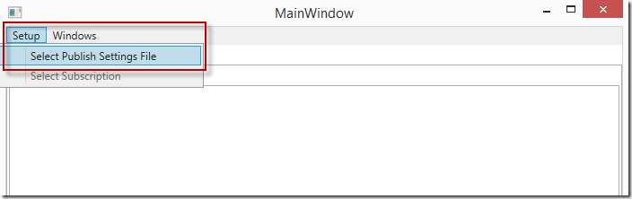
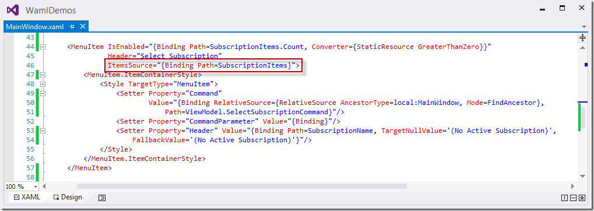
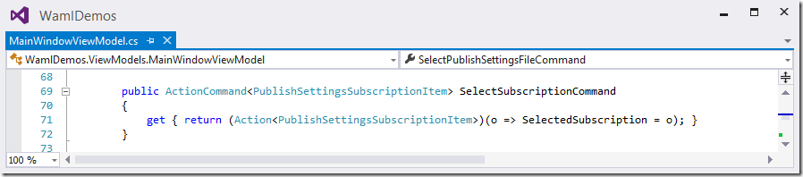
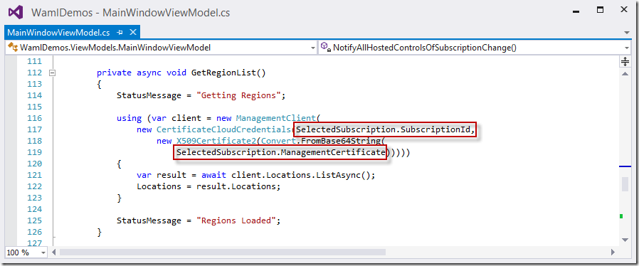

I am not very good at cryptography, even the most fundamental basic aspects of it. I&#x2019;m humble enough to be willing to admit this (or smart enough to put it out there so folks don&#x2019;t ask me questions about it, take your pick). That said, the idea of working
  with X509 Certificates in my code is something I obviously don&#x2019;t relish doing. It&#x2019;s a necessary thing, however, when working with various authentication paradigms, like the traditional method of attaching certificates to individual requests I&#x2019;d like
  to make to the Azure API. Since the first implementation of the credential-passing logic with the Management Libraries use X509 certificates, I needed to come up with an easy way of testing my code with management certificates. Luckily, the *.publishsettings
  files one can download from Azure via techniques like the PowerShell cmdlets&#x2019;
  <a href="http://msdn.microsoft.com/en-us/library/dn408501.aspx">Get-AzurePublishSettingsFile</a>  command provides a Base-64 encoded representation of an X509 Certificate. This post will walk through how I use the information in a publish settings file to authenticate my requests with the management libraries. 

<blockquote>
  
You won&#x2019;t want to put your publish settings files onto a web server, store the information in these files in your code, or anything like that. This is just for demonstration purposes, and makes the assumption you&#x2019;re working on your own machine, controlled
    by you, while you&#x2019;re logged into it in a nice and secure fashion. If some nefarious villain gets ahold of your publish settings file they could theoretically authenticate as you. Point is, be careful with these files and with the strings embedded
    into them. Keep them somewhere safe and secure when you&#x2019;re not using them. 

</blockquote>

Once you&#x2019;ve downloaded a publish settings file to your computer, you can write code that will open the files up and parse them. Don&#x2019;t worry, this is pretty easy, as the files are just normal XML files. So, you can use XLinq or any other XML-parsing techniques
  to read the values out of the file. In my example code for this and the other posts I&#x2019;m writing on the topic, you&#x2019;ll notice that I&#x2019;ve provided a menu you can use to open up a publish settings file. A screen shot of this application running is below:

   

When the user clicks this menu, I simply throw open a new Open File Dialog object and allow the user to select a *.publishsettings file from their machine. The screen shot below demonstrates this. 

   

When the user selects the file the code does just what you&#x2019;d expect &#x2013; it opens the file up, parses out the XML, and builds an array of subscription models the rest of my code will use when it needs to make calls out the API via the management libraries.
  The section of the code below that&#x2019;s highlighted is doing something pretty simple &#x2013; just building a list of a model type known as <strong>PublishSettingsSubscriptionItem</strong>  to which I&#x2019;ll data-bind a list of child menu items in my form. 

   

The XAML code that does this data-binding logic is below. This sample code (which will soon be available for your viewing pleasure) shown below does the data-binding magic. 

   

Once this code is in place and I select a publish settings file, the menu will be augmented with the list of subscriptions found in that publish settings file.

   

Since I&#x2019;ve got my XAML wired up in a nice command-like manner, selecting any of those items will fire the <strong>SelectSubscriptionCommand</strong>  method in my form&#x2019;s view model class. That method in turn sets the current selected subscription so that
  it can be used later on by management library client classes that need the information. The code below, which is the handler method for that command, does this magic. 

   

Now, whenever I need to run any management library code that reaches out to the Azure REST API, I can use the properties of my selected subscription to set up the two elements of data each client needs &#x2013; the subscription ID and the Base-64 encoded management
  certificate. The code below does exactly this to make a call out to the REST API to get the list of supported regions in the Azure fabric. 

   

Thanks to my good buddy and evil coding genius
  <a href="https://twitter.com/mlorbetske">Mike Lorbetske</a>  for MVVM-ifying this code so the demos can be easily added to support the upcoming blog posts in this series. I was mixing MVVM techniques and nasty, old-fashioned codebehind brutality together, and Mike came in just in time and helped
  me make this code a little more robust using MEF and some other tricks. 

