
Integration with Azure Active Directory was one of the main features we wanted to get into the 1.0 release of the Azure Management Libraries. Since Visual Studio and even the PowerShell Cmdlets (which use WAML, in fact) already have support for AAD, it
  was really important to all of us on the team that we have a method of providing authentication directly via AAD from within C# code using WAML. This makes for a synonymous login experience across all three of these (and more) areas. Most importantly,
  it makes it easy for Azure users to be able to manage all their subscription assets when they only need to login using their username/password portal credentials rather than go through the process of creating and uploading management certificates. This
  blog post will answer some of the questions and requests we&#x2019;ve had from the community on how to tie AAD and WAML together, to create AAD-authenticated applications code that can be used to manage your Azure account assets. 

<blockquote>
  
This won&#x2019;t be a deep-dive into how AAD works, but more a short examination on how it and WAML can be used together. 

</blockquote>

I worked quite a bit with the AAD team, especially
  <a href="http://www.cloudidentity.com/blog/">Vittorio Bertocci</a>, on this post. Our teams have a regular meeting so we&#x2019;re on the same page, but the guys on their team spent some additional cycles with us spelunking, coming up with features, and so on. As we talked about ideas, the AAD team gave
  me some great resources, like
  <a href="http://code.msdn.microsoft.com/AAL-Native-Application-to-fd648dcf">this post which walks through the process of setting up a client app so that it can be authenticated using AAD</a> . Vittorio&#x2019;s site has a series of
  <a title="Protecting a self-hosted Web API with AAD" href="http://www.cloudidentity.com/blog/2013/12/10/protecting-a-self-hosted-api-with-microsoft-owin-security-activedirectory/">great</a> 
  <a title="ASP.NET and AAD Organizational Accounts" href="http://www.cloudidentity.com/blog/2013/12/11/setting-up-an-asp-net-project-with-organizational-authentication-requires-an-organizational-account/">examples</a>  on how to go deeper with AAD. I won&#x2019;t go too deep into the inner-working of AAD in this post, so keep check out those great resources if you want more information. Thanks to the AAD team for all your help and patience and supporting our
  team!

Create a client app for managing Azure assets

The code for this sample application won&#x2019;t be too complicated. I&#x2019;m actually going to retrofit a small command line app I wrote the other day when asked by a peer in another team who wanted to export the list of Virtual Machine images in the gallery. The
  code for this itty-bitty application&#x2019;s beginnings is below, which makes use of the
  <a href="http://www.nuget.org/packages/Microsoft.WindowsAzure.Management.Compute">Compute Management Management Library</a> . 

  <a href="http://www.bradygaster.com/posts/files/4b076ee9-f664-4c1c-91ad-05b7cc0b85f7.png">
    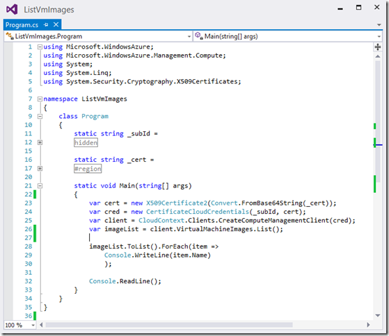
  </a> 

With this code already working using my Management Certificate, and with it being a relatively simple app, it seemed like a great case for demonstrating how easy it is to switch out the <strong>CertificateCloudCredentials</strong>  for the <strong>TokenCloudCredentials</strong>   class once the AAD infrastructure is set up and ready. Speaking of that, this would be a good time to walk through the process using the Azure portal to set up an AAD application in my AAD directory that I can develop that will use the Management Libraries
  to manage my subscription. 

Setting up an AAD application using the portal

To authenticate using AAD I first need to create an application in my Azure subscription&#x2019;s existing Active Directory tenant. To do this I go to my AAD tenant page in the portal and click the <strong>Applications</strong>  tab at the top. 

  <a href="http://www.bradygaster.com/posts/files/f975a342-4946-458d-8321-e4fc9d49afb5.png">
    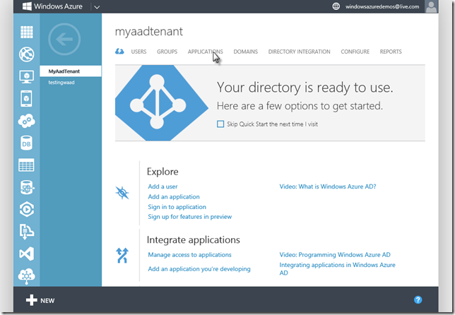
  </a> 

I currently have no applications authenticating against my directory so I&#x2019;ll click the <strong>Add</strong>  button at the bottom of the portal. 

  <a href="http://www.bradygaster.com/posts/files/2f5917dd-78cd-476b-9e5c-08489fe40100.png">
    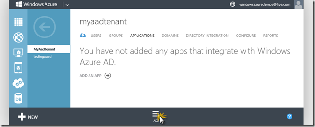
  </a> 

Selecting the second option in this list presents me with a huge list of existing applications with which AAD can integrate. Since I&#x2019;m interested in authenticating an application I&#x2019;m writing, I&#x2019;ll click the first option.&#xA0; 

  <a href="http://www.bradygaster.com/posts/files/9e356bf0-deaf-43cf-bd30-7a205132d93b.png">
    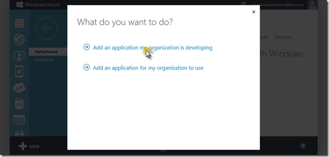
  </a> 

The application I&#x2019;m writing is a small console application, not a web app. Hence I&#x2019;ll select the second option &#x2013; <strong>Native Client Application</strong>  - in the <strong>Add Application</strong>  dialog, shown below. If I&#x2019;d wanted to put an ASP.NET
  Web API up in the cloud that would use AAD on the back end for authentication, I&#x2019;d select the top option, <strong>Web Application and/or Web API.</strong>  The API my client app will need to access is the actual Azure Service Management API, which AAD
  has a special provision for in the portal that will be examined in a moment. 

  <a href="http://www.bradygaster.com/posts/files/5e88606e-9330-4423-b245-7dcb7ff2ad0f.png">
    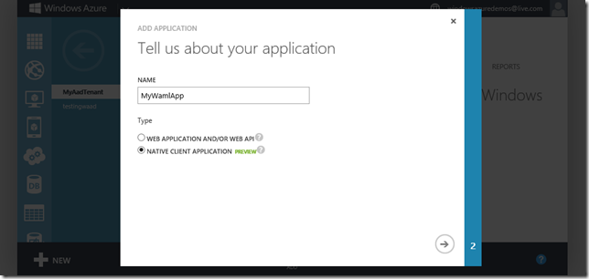
  </a> 

Next, I&#x2019;ll need to provide a redirect URI. Even though the application I&#x2019;m writing is a native app, I still need to provide this URI to give AAD more details on the specific application that will be authenticating. 

  <a href="http://www.bradygaster.com/posts/files/ffb360e1-8e2d-4a01-aa7c-79e9e374741e.png">
    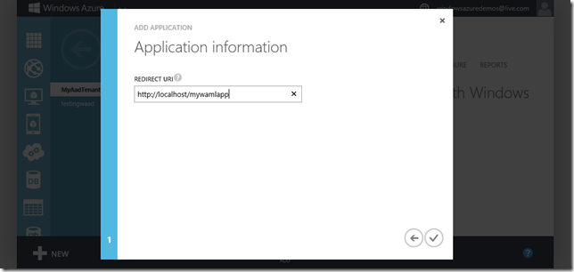
  </a> 

Once these settings are made, I can see the application&#x2019;s <strong>client id</strong>  in the portal, along with the information I provided during the application&#x2019;s creation process. The MSDN code site article I mentioned above, written by the AAD team,
  <a href="http://code.msdn.microsoft.com/AAL-Native-Application-to-fd648dcf">walks through more details</a>  of how the client application authentication workflow functions and offers more details, so definitely check out that sample if you need more information on these settings. For now, what&#x2019;s important to remember from this
  window are the <strong>client id </strong> text box and the <strong>redirect URI</strong>  created below. Those two strings make up 2 of the 3 strings I&#x2019;ll need to authenticate a WAML application with AAD. 

   

The final piece of information is the AAD tenant id, which can be found by clicking the <strong>View Endpoints</strong>  button in the portal when on the page for the directory I wish to use to authenticate users. 

   

The URI provided in each of the text boxes in the resultant dialog contain a GUID. This GUID is the tenant id, so it&#x2019;ll need to be copied out for use in my code. 

   

Changing the WAML code to perform AAD authentication

Back in Visual Studio I&#x2019;m ready to change the code to make use of AAD authentication. The first step is to reference the required NuGet package, the
  <a href="http://www.nuget.org/packages/Microsoft.IdentityModel.Clients.ActiveDirectory/">Active Directory Authentication Library (ADAL)</a> . This will enable my project the ability of prompting the user with a login dialog, into which they can enter their Microsoft account username and password. It will also add all sorts of goodness from
  the AAD folks that you can make use of in your client applications. 

   

In the code I&#x2019;ll add a method called <strong>GetAuthorizationHeader</strong>  that will take my tenant id as a parameter. I&#x2019;ll presume the calling code might want to make use of the common tenant, but will give callers the ability to pass in their own
  tenant GUID identifying their custom Active Directory tenant. Take note that within this method I&#x2019;m making use of the application&#x2019;s settings, the redirect URL and the client id property from the portal. As well. I&#x2019;m passing the base URI of the Azure
  REST API as the value for the <strong>resource </strong> parameter to the
  <a href="http://msdn.microsoft.com/en-us/library/microsoft.identitymodel.clients.activedirectory.authenticationcontext.acquiretoken.aspx">AuthenticationContext.AcquireToken</a>  method.
  <a href="http://www.cloudidentity.com/blog/2013/09/12/active-directory-authentication-library-adal-v1-for-net-general-availability/">Vittorio has a great blog post introducing ADAL</a>  and what you can do with it, so if you&#x2019;re looking to dive deeper on this topic head on over to
  <a href="http://www.cloudidentity.com/blog/">CloudIdentity.com</a>  and check it out. In a more practical implementation I should probably be setting those values up as <em>appSetting</em>  variables, but for this demonstration code sheer pasting in the values is sufficient.

  <a href="http://www.bradygaster.com/posts/files/847e4fe2-95a1-4b83-9856-c8d6eecf77c9.png">
    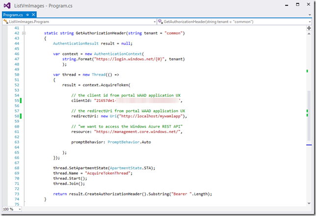
  </a> 

The final step in the code is to comment out the old authentication mechanism, where I was using the
  <a href="http://msdn.microsoft.com/en-us/library/system.security.cryptography.x509certificates.x509certificate2(v=vs.110).aspx">X509Certificate2</a>  class to authenticate using a management certificate. In place of this code, which creates an instance of a new CertificateCloudCredentials class, I&#x2019;ll make a call to the new GetAuthorizationHeader method to get my token, then use
  that token as a parameter to an instance of the
  <a href="https://github.com/WindowsAzure/azure-sdk-for-net/blob/master/src/Common/Credentials/TokenCloudCredentials.cs">TokenCloudCredentials</a>  class. 

   

Authorizing access to the Azure Service Management API to my client application

At this point the code <em>almost </em> works. However, when I run it I get an error that pretty clearly indicates what&#x2019;s wrong in the exception message. Clearly, this application hasn&#x2019;t been granted access to the service management API. 

  <a href="http://www.bradygaster.com/posts/files/c4116092-8344-41c0-8d10-20ff91fc1c99.png">
    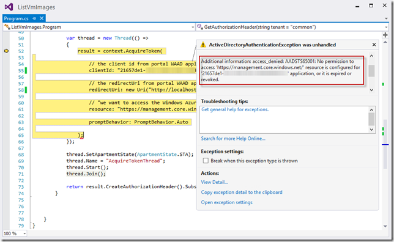
  </a> 

A recently-added (okay, a personally recently-<em>discovered</em> ) feature within the portal allows me to specify which applications I&#x2019;m going to allow access to this client application. Since I&#x2019;ve not yet created any APIs that also use AAD as an authentication
  mechanism I&#x2019;ll only see the two default items in this drop-down menu (the Graph Explorer and the Service Management API). By selecting the option <strong>Azure Service Management API</strong>, I effectively grant my client application access to any
  of the REST API URLs available under <strong>https://management.core.windows.net</strong> . Once I save this setting, the code should run and give me back the list of Virtual Machine images from the gallery. 

  <a href="http://www.bradygaster.com/posts/files/54270861-8db9-4e9e-bd05-6af40e4d83a3.png">
    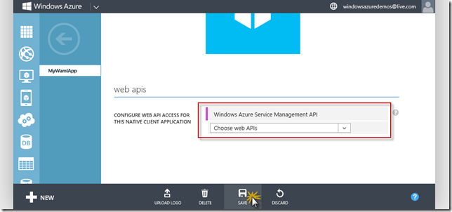
  </a> 

When I run the code this time, it works as expected. I&#x2019;m prompted for my credentials, thanks to some of the functionality provided in the ADAL package. 

  <a href="http://www.bradygaster.com/posts/files/5520cb9f-1a15-4281-bb13-ad15f6bd1050.png">
    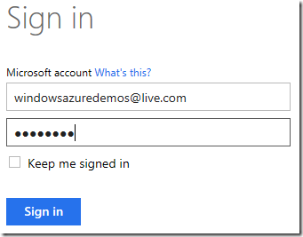
  </a> 

Once I log in using my subscription&#x2019;s credentials, WAML can authenticate and pull down the list of virtual machines. 

  <a href="http://www.bradygaster.com/posts/files/533dd96e-74ee-4830-a386-08321f8639ad.png">
    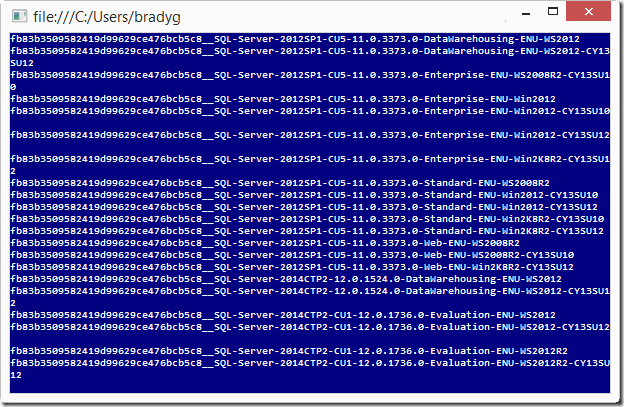
  </a> 

From here, I could use the rest of the functionality available in WAML to do whatever I need. Now that I&#x2019;m able to authenticate using AAD, I won&#x2019;t need to create, upload, configure, and track my management certificates. Rather, my applications can just
  make use of Active Directory to log in and manage my subscription&#x2019;s assets. 

I hope you find this to be an exciting new option available in the Azure Management Libraries. I&#x2019;ve been looking forward to showing this feature off, as I think it shows two awesome areas of the client developer experience &#x2013; AAD via ADAL and the REST
  API via WAML &#x2013; being used together to create some amazing client-side magic against the Azure cloud. Thanks again to the AAD folks for lending a hand from time to time with some of the details and fine tuning! 

