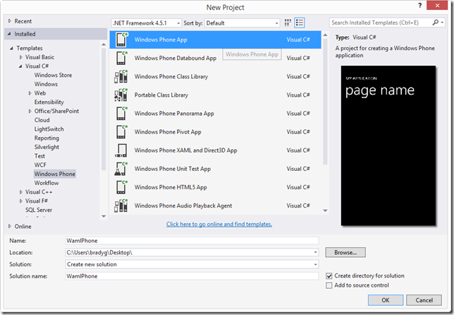
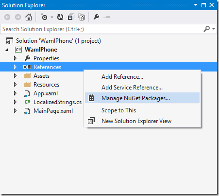
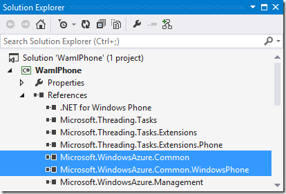
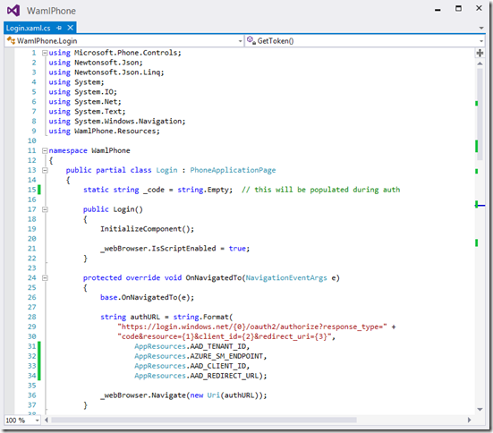
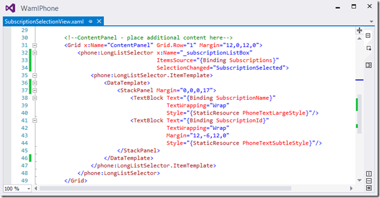
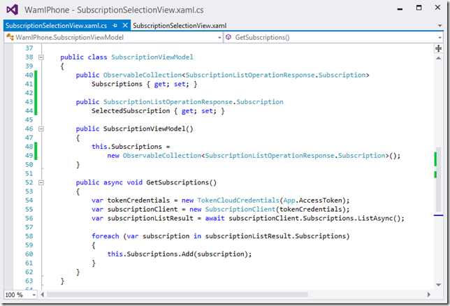
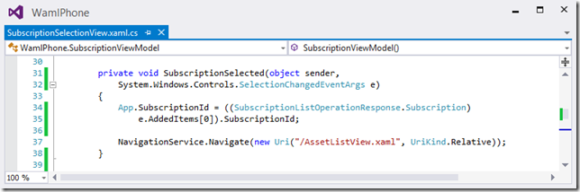
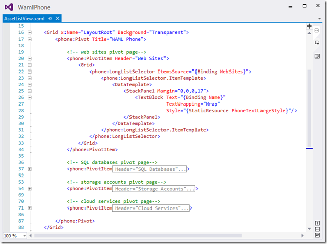
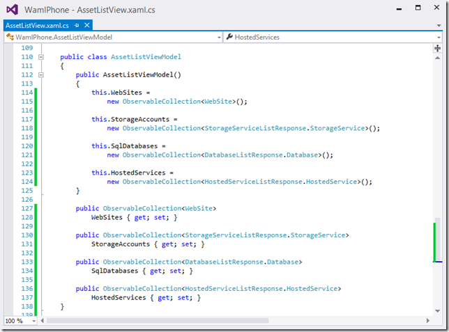

Since the initial release of the
  <a href="http://www.nuget.org/packages?q=Microsoft.WindowsAzure.Management&amp;prerelease=true&amp;sortOrder=relevance">Azure Management Libraries (WAML)</a>  as
  <a href="http://msdn.microsoft.com/en-us/library/vstudio/gg597391(v=vs.110).aspx">Portable Class Libraries</a>  (PCL, or <em>pickles</em>  as I like to call them) we&#x2019;ve had tons of questions from community members like
  <a href="https://twitter.com/pvandorp">Patriek</a>  asking how Windows Phone applications can be written that make use of the cloud management functionality WAML offers. At first glance it would seem that WAML is &#x201C;unsupported on Windows Phone,&#x201D; but the reality is that WAML is fully supported
  via it being a PCL, but some external factors made it seem just shy of impossible to be able to glue our PCL framework to each of the targeted client platforms. In the case of Phone, there are two blockers: 

<ol>
  <li>Since the <em>X509Certificate2 </em> class is unsupported on Windows Phone developers can&#x2019;t make use of the certificate-based method of authenticating against the Azure REST API
    </li><li>Since there&#x2019;s no
      <a href="https://www.nuget.org/packages/Microsoft.IdentityModel.Clients.ActiveDirectory/1.0.0">ADAL</a>  implementation that targets Phone there&#x2019;s no way to use ADAL&#x2019;s slick functionality to get my authentication token. The assumption here is that some creative coding is going to have to be done to go deeper into the OAuth stack. Sounds nasty.
      </li>
</ol>

Well, that&#x2019;s never stopped any motivated coder before, right? Armed with some code from Patriek, a problem statement, and a pretty
  <a href="http://www.cloudidentity.com/blog/2013/04/29/fun-with-windows-azure-ad-calling-rest-services-from-a-windows-phone-8-app/">informative blog post written by none other than Vittorio on how he had some fun tying Phone to REST Services using AAD</a>, I set out to start at ground zero to get some code working on my phone that would enable me to see what&#x2019;s happening in my Azure
  subscription, across all my sites, services, and data stores. I set out to create a new type of phone app that will give me complete control over everything I&#x2019;ve got published to my Azure cloud subscription. This post will walk through the code I worked
  up to get a baseline Windows Phone mobile cloud management app running. 

Creating and Configuring the Phone App

First, a little background is required here. As Vittorio&#x2019;s post makes very clear, the OAuth dance the WP8 code is going to be doing is pretty interesting, challenging, and results with a great set of functionality and an even greater starting point if
  this app gives you some ideas on what you could make it do next. In fact, if you&#x2019;re into that whole <strong>social coding</strong>  thing, the code in this post
  <a href="https://github.com/bradygaster/wamlphone">has a GitHub repository right here</a> . The code in the repository contains the project I created in this screen shot in more detail.

   

The first step is to pull down the NuGet pacakges I&#x2019;ll need to write this application. In this particular case I&#x2019;m kind of thinking of writing a Windows Phone app that I&#x2019;ll use to management my Azure Web Sites, Cloud Services, SQL Databases, Storage Accounts,
  and everything in between. So I&#x2019;ll right-click my Phone project and select the correct packages in next step.

   

I&#x2019;ll go ahead and pull down the entire WAML NuGet set, so I can manage and view all of my asset types throughout the my Azure platform subscription. By selecting the
  <a href="http://www.nuget.org/packages?q=Microsoft.WindowsAzure.Management.Libraries&amp;prerelease=true&amp;sortOrder=relevance">Microsoft.Azure.Management.Libraries</a>  package, all of the SDK Common and WAML platform NuGets will all be pulled down for this application to use. 

   

The Common SDK, shown below in the project&#x2019;s references window, provides the baseline HTTP, Parsing, and Tracing functionality that all the higher-order WAML components need to function. Next to that is the newest member of the Common SDK tools, the Common
  Windows Phone reference, which is new in the latest release of the Common SDK package. This new addition provides the high-level functionality for taking token credentials from within the Windows Phone client and being able to attach those credentials
  to the SDK client code so that calls made to the Azure REST API from a phone are authenticated properly. 

   

If you read
  <a href="http://www.bradygaster.com/post/using-windows-azure-active-directory-to-authenticate-the-management-libraries">my last blog post on using WAAD and WAML</a>  together to authenticate WAML-based client applications, there are a few important steps in that post about working through the process of adding an application that can authenticate on behalf of your WAAD
  tenant.
  <a href="http://www.bradygaster.com/post/using-windows-azure-active-directory-to-authenticate-the-management-libraries">Take a look at that post here</a>  to get the values for the App Resources dialog in the screen shot below. In a sense, you&#x2019;ll be setting application settings here that you can get from the Azure portal. You&#x2019;ll need to create an application, then get
  that app&#x2019;s client id, and your subscription and active directory tenant id or domain name, and place those values into the code&#x2019;s resources file, as shown below. 

   

The Login View

The first view shows a built-in web browser control. This web browser will be used to direct the user to the login page. From there, the browser&#x2019;s behavior and events will be intercepted. The authentication data the form contains will then be used to
  manually authenticate the application directly to AAD. 

<blockquote>
  
Reminder &#x2013;
    <a href="http://www.cloudidentity.com/blog/2013/04/29/fun-with-windows-azure-ad-calling-rest-services-from-a-windows-phone-8-app/">As Vittorio&#x2019;s post pointed out</a>, you might not want to use this exact code in your production app. This is a prototype to demonstrate putting it all together in the lack of important resources. Something better will come along soon. For now the
    OAuth dance is sort of up to me. 

</blockquote>

Note the web browser control has already been event-bound to a method named <em>webBrowser_Navigating</em>, so each time the browser tries to make a request this method handler will run first, and allow my code to intercept the response coming back to
  the browser. 

   

Once the login page loads up, I&#x2019;ll presume a login is in order, so I&#x2019;ll go ahead and navigate to the login page, passing in a few of my own configuration parameters to make sure I&#x2019;m hitting my own AAD tenant. 

   

Vittorio deep-dives on the workflow of this code a lot better than I&#x2019;ll try to do here. The basic idea is that the browser flow is being intercepted. Once the code realizes that AAD has authenticated me it hands back a URL beginning with the string I
  set for the <strong>redirectUrl</strong>  property of this application in the portal. When my code sees my <strong>redirectUrl</strong>  come through, I just run the <strong>GetToken()</strong>  method to perform the authentication. It posts some data
  over the wire again, and this time, the response activity is handled by the <strong>RetrieveTokenEndpointResponse()</strong>  event handler.

   

Once this handler wakes up to process the HTTP response I&#x2019;ve received from the AAD authentication workflow (that we did via the OAuth dance), my access token is pulled out of the response. The subscription id value is then persisted via one of my App&#x2019;s
  properties, and the next view in the application is shown. 

   

When the user first opens the app, the obvious first step is visible. We need to show the user the AAD login site, and allow the user to manually enter in their email address and password. In this window. I could use a Microsoft (Live/Hotmail/etc.) account
  or an organizational account. The latter, so long as they&#x2019;ve been marked as Azure subscription co-admins, would be able to log in and make changes, too. 

   

Once the user logs in they&#x2019;ll be shown a list of their subscriptions, so let&#x2019;s take a look at how the code in the subscriptions view is constructed. 

Selecting a Subscription

The subscription selection view just shows a list of subscriptions to the user in a long scrolling list. This list is data-bound to the results of a REST API call made via the <strong>SubscriptionClient</strong>  class, which goes out and gets the list
  of subscriptions a user can view. 

<blockquote>
  
Note &#x2013; even though I can see my full list of subscriptions, I&#x2019;ve only installed the Application into one AAD tenant in one of my subscriptions. If I click any of the other subscriptions, things won&#x2019;t work so well. A subscription and a tenant are tied
    together. Unless your application gets special permission (it does happen from time to time, I <em>hear</em> ) your application can only access Azure assets in the same subscription. If you wanted to work across subscription you&#x2019;d have a little more
    work to do. 

</blockquote>

The XAML code below shows how the list of subscriptions will be data-bound to the view. I may eventually go into this code and add some view/hide logic that would show only those subscriptions I could impact using the application settings I&#x2019;ve got running
  in this app. Point is, I can see all of the subscriptions I can manage and conceptually manage them with some additional coding. 

   

The code below is what executes to log a user in with their stored access token and subscription id, when the <strong>TokenCloudCredentials</strong>  class is used to wrap their credentials up as a single construction parameter to most of the management
  client. Since I was able to get a token from the OAuth dance with AAD, and since I know which subscription ID I want to affect, I&#x2019;ve got everything I need to start working against the rest of the service management REST API endpoints. 

   

When the subscriptions page loads, it gives me the chance to select the subscription I want to manage. <strong>Note: </strong> I just need to <em>be cautious </em> and <em>only click the subscription that matches the subscription where my AAD tenant is set up</em> .
  In my case, I&#x2019;ve got the application installed into my AAD tenant that lives in the subscription named <strong>Azure MSDN &#x2013; Visual Studio Ultimate</strong> . If I were to select any of my other subscriptions I&#x2019;d get an exception. 

<blockquote>
  
To have true parity across all subscriptions you&#x2019;d need to have an application setup in each of your directories and some additional configuration, <em>or </em> you&#x2019;d have to allow other tenants set up
    <a href="http://msdn.microsoft.com/en-us/library/windowsazure/dn151789.aspx">multi-tenancy</a>  with your AAD tenant. 

</blockquote>

   

Once the subscription list is data-bound the user can select a subscription to work with. Selection of a subscription item in the list fires the following code. 

   

It persists the subscription id of the subscription the user selected, and then navigates the user to the <strong>AssetListView </strong> page, which will show more details on what&#x2019;s in a user&#x2019;s Azure subscription.

Viewing Cloud Assets via Mobile Phone

To provide a simple method of being able to scroll through various asset types rather than emulate the Azure portal, I made use of the <strong>LongListSelector</strong>  and <strong>Pivot</strong>  controls. In each Pivot I display the type of Azure asset
  being represented by that face of the pivot control. Web Sites, <em>slide</em>, Storage, <em>slide</em>, SQL, <em>slide</em>, Cloud Services&#x2026; and so on. The idea for the phone prototype was to show how WAML could be used to load ViewModel classes that
  would then be shown in a series of views to make it easy to get right to a particular asset in your Azure architecture to see details about it in a native Phone interface. 

   

Since the assets list page is primarily just a logically-grouped series of lists for each of the types of assets one can own in their Azure stack, the ViewModel class&#x2019;s main purpose is to expose everything that will be needed on the view. It exposes Observable
  Collections of each type of Azure asset the app can display. 

   

What would be better as controller functionality, the code in the codebehind of the view ends up doing most of the data-acquisition from the Azure REST APIs via WAML calls. In the code sample below the <strong>GetWebSites</strong>  method is highlighted,
  but the others &#x2013; <strong>GetSqlDatabases, GetStorageAccounts, and GetHostedServices</strong>  &#x2013; all do the same sorts of things. Each method creates instances of appropriate management client classes, retrieves asset lists, and data-binds the lists so
  that the assets are all visible in the Windows Phone client. 

   

The web sites pivot is shown below. I&#x2019;m thinking of adding a deeper screen here, one that would show site statistics over the last <em>N </em> days, maybe add an appSetting and connectionString editor page, or something else. Have any ideas? 

   

Here&#x2019;s a list of my cloud services &#x2013; 2 empty PaaS instances and 1 newly set-up VM instance. 

   

Summary

Though the OAuth dance has a few drawbacks and the code is a little less elegant than when I could make use of ADAL in my previous example, it works. Once I have the token information I need from the browser, I can run with that information by creating
  an instance of a TokenCloudCredential, passing in the token I received from the OAuth dance to get to authenticate WAML and therefore, make calls out to the Azure Service Management API to automate my asset management. Since WAML is a PCL package, and
  as a result of the introduction of support for the Windows Phone platform into the SDK Common NuGet package, the community can now freely experiment with solutions combining Windows Phone and the Management Libraries. 

Happy Coding!

